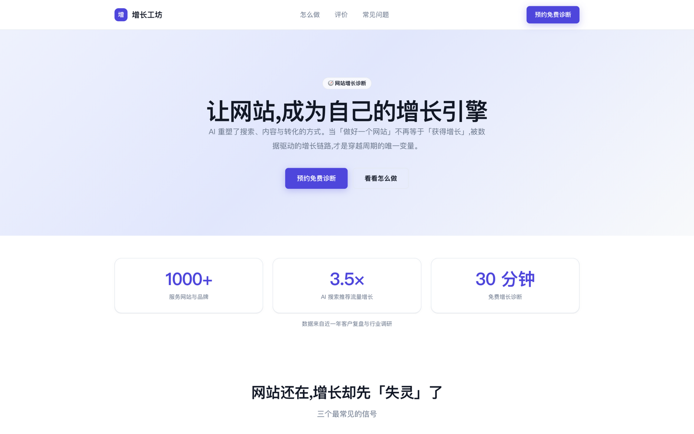
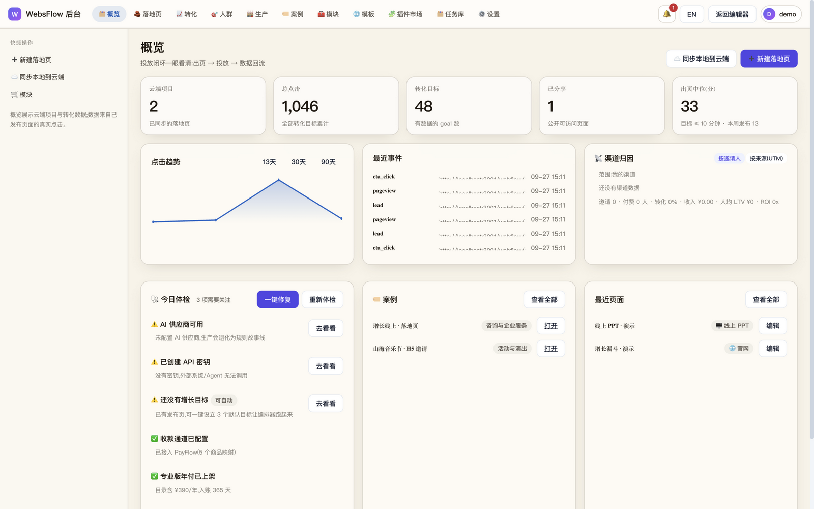
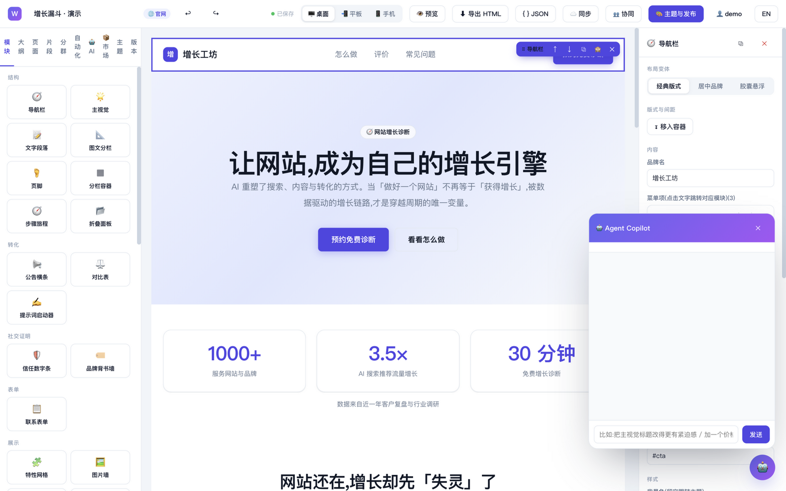
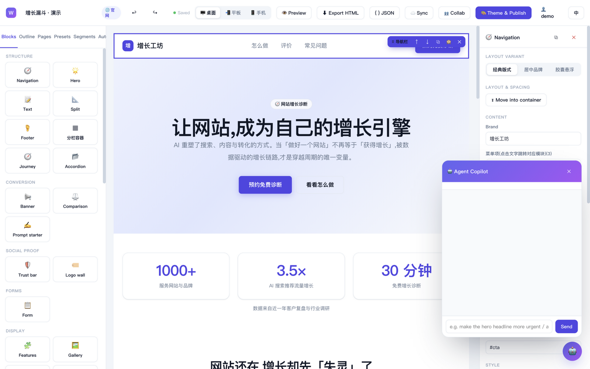

<div align="center">

# WebsFlow 魔块 —— 面向投放的落地页工场

**让一个人像一支投放团队:出页、上线、看数据、放量,当天完成一次闭环。**

[](CHANGELOG.md)
[](LICENSE)
[](#快速开始)
[](docs/DEPLOY.md)

[在线 Demo(仅预览)](https://nownexts.com/webflow/) · [部署指南](docs/DEPLOY.md) · [功能总附录](docs/APPENDIX-FEATURES.md) · [变更日志](CHANGELOG.md)

</div>

---

## 这是什么:为什么投放需要一个"工场"

做投放的人,每天真正在做的事是:**换一个角度重写同一句话,再换一个人群试一次**。
页面要快、要多、要能看出哪一个在赚钱。但现有工具都为别的目的而生:

- 建站工具(CMS/低代码)为"官网"而生,出一个落地页要配置半天,改一个标题要翻三层菜单;
- H5 制作工具为"传播"而生,页面好看,但没有埋点、没有数据回流,投放等于盲投;
- 千人千面是广告平台的能力,页面本身永远是"千人一面",落地页和创意对不上。

WebsFlow 把投放的真实工作流——**出页 → 上线 → 数据回流 → 放量**——收进同一个工场:

1. **出页快**:44 个成品模块、13 套场景模板,默认文案即可上线,5 分钟产出一个可投放页面;
2. **上线直**:导出即单文件 HTML 直接挂广告,或一键托管成 `https://你的域名/webflow/p/<token>`;
3. **数据回流**:每个页面自带埋点与转化看板,哪个来源、哪句文案带来的点击与线索,一目了然;
4. **千人千面**:块级人群定向,新/老访客、UTM 来源、设备、时段……同一页面,不同人看到不同内容;
5. **放量有流水线**:故事线 → A/B → 质检 → 交付包,批量出页从"手工作坊"变成"生产线"。

```
选模板/拖模块 → 改文案 → 故事线 → A/B 变体 → 质检 → 交付包
     ↓                                          ↓
  发布托管(/webflow/p/<token>)或导出单文件 HTML → 投放
     ↓
  转化埋点 → 看板 / 分群归因 / 千人千面 → 沉淀为模板与模块
```

它不是全站建站工具。全站资产、SEO、CRM、商城交给兄弟项目
[OpenFlow](https://github.com/sevenaaaaaaaaa/openflow)(全站增长操作系统)承接;
WebsFlow 只做投放前线:**单页 · 数据 · 千人千面 · 模块化 · H5**。两者账号互通,线索互相流转。

适合谁来用:**投放操盘手**(今天建计划,今天要有页)、**增长团队**(要数据、要 A/B、要人群分层)、
**独立开发者与小店主**(不懂代码,要一个能收线索的页)。如果你要的是长期运营的企业官网和全站
SEO,请用矩阵里的 OpenFlow——那是另一个生态位。

## 系统长什么样:每一个界面都是投放工序

**① 三栏工作台:从模块到页面,十分钟的路** —— 左栏选模块、中间画布改文案、右侧检查器调细节;
布局变体一键切换,自动保存 + 版本快照,改坏了随时回滚。


**② 导出即投放:单文件 HTML,拎起来就能挂广告** —— Meta/OG/Twitter Card/JSON-LD/图片懒加载全部内嵌,
不依赖任何运行时,放到任意静态空间就是一个正式落地页。



**③ 数据回流:出页之后的事,这里接着管** —— 云端项目、点击趋势、最近事件、渠道归因、今日体检,
投放闭环一眼看清:出页 → 投放 → 数据回流。



**④ 千人千面:同一页面,不同人看到不同内容** —— 按分群给每个模块配置人群定向,
新访客看价格,老访客看评价,付费流量看活动,自然流量看口碑。


<details>
<summary><b>更多界面</b>(模块库 / 托管发布页 / 英文界面)</summary>






</details>

## 特色能力

### 内容模型驱动:一份内容,四种形态

每个模块都是一份带 schema 的结构化文档(理念来自 Sanity/Contentful):内容与呈现分离,
字段定义驱动右侧检查器自动生成表单。同一份内容可以渲染成**官网 / H5 / 线上 PPT / 互动故事**
四种形态——桌面投放、移动传播、提案演示、滚动叙事,一个工场全包。

### 44 个成品模块,13 套场景模板,默认文案即可上线

导航、主视觉、价格表、对比表、信任数字、时间线、Bento 网格、倒计时、互动问答……
44 个模块覆盖投放页全部叙事环节,120+ 布局变体一键切换;13 套场景模板(官网 / H5 / PPT / 故事四形态)
每套都是完整可投的成品页。每个模块都按
「信任 → 痛点 → 方法 → 证明 → 行动」的转化叙事组织,**不堆功能,只服务于转化**。

### 导出即投放

导出的单文件 HTML 自带 SEO Meta、OG/Twitter Card、JSON-LD 结构化数据、图片懒加载,
零依赖、双击可开,可直接挂广告平台与社媒分享。也可以导出 JSON 内容包,在项目之间迁移复用。

### 千人千面:块级人群定向

按访客身份(新/老)、登录态、UTM 来源、设备、国家、时段给**每一个模块**配置可见性,
还可以组合成分群复用。SSR 与浏览器端判定逻辑同源,托管页与导出页行为一致。

### 数据回流与增长 Agent

页面侧埋点自动回传(pageview/cta_click/lead),后台提供转化看板、转化目标编排、
分群归因、A/B 实验与端到端轨迹。增长 Agent 在人审 + 风控的边界内给出建议,
**发布、收款、外发动作永远有人工闸门**。

### 开放底座:API + MCP + 插件

全部后台能力都有 REST API(项目 / 事件 / 目标 / 分群 / 生产 / 计费等 27 组路由),
内置 MCP Server 与能力目录,AI Agent 与外部系统可以程序化操作整个工场;
市场支持安装模块插件,开发者可以用几十行 JSON 注册一个自定义模块。

## 用例:它替你完成的那些"明天就要"

| 场景 | 用 WebsFlow 怎么做 |
|---|---|
| **广告投放落地页** | 选「增长漏斗」模板 → 改文案 → 导出 HTML 挂广告,当天上线 |
| **活动 H5 邀请** | 选 H5 形态 + 行业模板,底部悬浮 CTA + 进度叙事,微信直接打开(已上线案例:山海音乐节 H5 邀请) |
| **课程 / 活动招生** | 联系表单 + 倒计时 + 名额提醒,线索直接回流后台看板 |
| **到店预约** | 地图 + 预约表单 + 信任数字,本地商家五分钟出页 |
| **线上提案 / 路演** | PPT 形态:封面页、要点页、金句页、结尾页,键盘翻页全屏放映 |
| **矩阵批量出页** | 生产流水线:一条故事线批量生成 A/B 变体,质检通过后打交付包,多个投放位同时开工 |

## 快速开始

```bash
# 零安装:双击 index.html,或
python3 -m http.server 8080

# 自托管(推荐,Docker)
git clone https://github.com/sevenaaaaaaaaa/websflow.git
cd websflow
export JWT_SECRET="$(openssl rand -hex 32)"
docker compose up -d --build
# 打开 http://服务器IP:3001/webflow/
```

1. 选行业模板或空白页
2. 画布改文案,左侧拖模块
3. 登录后「同步 / 发布」,得到 `https://你的域名/webflow/p/<token>`,或者直接导出 HTML

原生部署(Node 18+,无需 MySQL/Redis)、宝塔/Apache/Nginx 反代、NAS 部署、环境变量与备份说明,见 **[部署指南](docs/DEPLOY.md)**。

## 关于在线版与自部署

**WebsFlow 没有官方托管 SaaS。** [nownexts.com/webflow/](https://nownexts.com/webflow/) 只是为你提供一个
demo 预览的机会,数据随时可能清理,请不要把它当正式环境。

正式使用请自部署:云服务器、NAS、家用本地服务器都可以——学习能力强、想把自己的投放数据握在自己手里的
DRI 与 OPC,是我们的目标用户。我们会持续适配和探索主流开源项目的部署方式(Docker Compose 已就绪,
宝塔/1Panel 镜像在路线图上)——这并不是难事,是诚意。

## 开源开放

WebsFlow 的**核心功能过去、现在、将来都持续开源**,MIT 协议:模块化出页、四形态适配器、
主题系统、导出器、埋点与看板、分群与千人千面、生产流水线、API 与 MCP,一个都不锁在付费墙后。

现阶段商业化只有两件小事:模板市场里他人上传的**小额付费模板**,以及**定制化开发服务**。
它们是给生态贡献者的回报,不是核心功能的门票。

我们欢迎并且鼓励:

- **fork 与二次开发**:在 MIT 之下,任何组织与个人都可以 fork 出自己的版本参与市场竞争;
- **插件开发**:几十行 JSON 即可注册一个自定义模块(`WF.registerPluginBlocks`),欢迎发布到市场;
- **矩阵生态**:与 [OpenFlow](https://github.com/sevenaaaaaaaaa/openflow)(全站增长)、
  [PayFlow](https://github.com/sevenaaaaaaaaa/payflow)(收款)、
  [MFlow](https://github.com/sevenaaaaaaaaa/mflow)(内容产能)等同矩阵产品互通,账号互通已上线。

## 文档

[部署指南](docs/DEPLOY.md) · [使用指南](docs/USAGE-GUIDE.md) · [功能总附录](docs/APPENDIX-FEATURES.md)(每个模块的截图、字段与使用说明) · [变更日志](CHANGELOG.md) · [定价口径](docs/PRICING.md) · [产品规划](docs/PRODUCT-PLAN.md)

## 当前边界(诚实声明)

- **没有官方托管 SaaS**:demo 仅预览;数据与业务请自部署;
- **多人协同尚未完成**:编辑器内的「协同」按钮当前不可用,相关能力在开发中;
- **AI 能力取决于你配置的模型**:未配置时,生产流水线退化为规则故事线,界面明确提示、不假成功;
- **配额存在**:免费版云端项目 3 个 / 发布页 1 个;专业版 ¥39/月 或 ¥390/年(收款走 PayFlow,可完全关闭);
- 不做全站 CMS、CRM/电商业务系统、重型运维后台——那交给 OpenFlow,我们把投放单页做透。

我们区分**已实现 / 已接入 / 已被使用 / 已验证有效**,不把远景写成现状。

## License

[MIT](LICENSE) · 与 [OpenFlow](https://github.com/sevenaaaaaaaaa/openflow) 同属一个开源增长产品矩阵。
