# WebsFlow 功能总附录

> 每个大模块的每个小功能:一张截图 + 一段功能介绍 + 一段使用说明。
> 截图来自 v4.38.0 本地构建(演示数据),与代码行为一致;界面文案以中英双语版为准,中文为主。
> 快速上手请先读 [README](../README.md);部署问题见[部署指南](DEPLOY.md)。

## 目录

1. [开始之前:三种打开方式](#一开始之前三种打开方式)
2. [三栏工作台与顶栏工具](#二三栏工作台与顶栏工具)
3. [左栏十大面板](#三左栏十大面板)
4. [内容模块全库(44 个,字段级说明)](#四内容模块全库)
5. [行业模板与场景模板](#五行业模板与场景模板)
6. [主题系统](#六主题系统)
7. [导出与发布](#七导出与发布)
8. [千人千面与分群](#八千人千面与分群)
9. [数据与转化](#九数据与转化)
10. [生产流水线](#十生产流水线)
11. [后台 Console 逐页说明](#十一后台-console-逐页说明)
12. [AI 能力与任务库](#十二ai-能力与任务库)
13. [开放能力:API / MCP / 插件](#十三开放能力api--mcp--插件)
14. [账号、配额与商业化](#十四账号配额与商业化)
15. [快捷键与实用细节](#十五快捷键与实用细节)

---

## 一、开始之前:三种打开方式

### 首页(项目列表 + 场景入口)

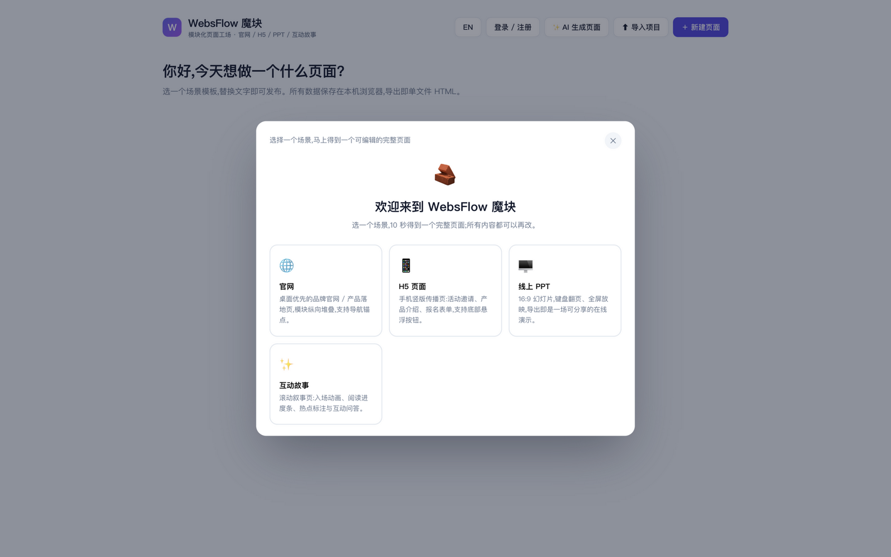

**这是什么**:启动 WebsFlow 看到的第一个页面。顶部是品牌区与全局动作(语言切换、登录/注册、AI 生成页面、导入项目、新建页面),下方是已有的本地项目列表与场景模板入口。

**怎么用**:

- 第一次使用:点「＋ 新建页面」,或直接在下方场景卡片里选一个;
- 老用户:点项目卡片继续编辑;卡片右侧垃圾桶按钮删除项目;
- 「⬆ 导入项目」接受 `.websflow.json` 内容包,用于迁移或备份恢复。

### 新建页向导:形态 × 模板 × 命名

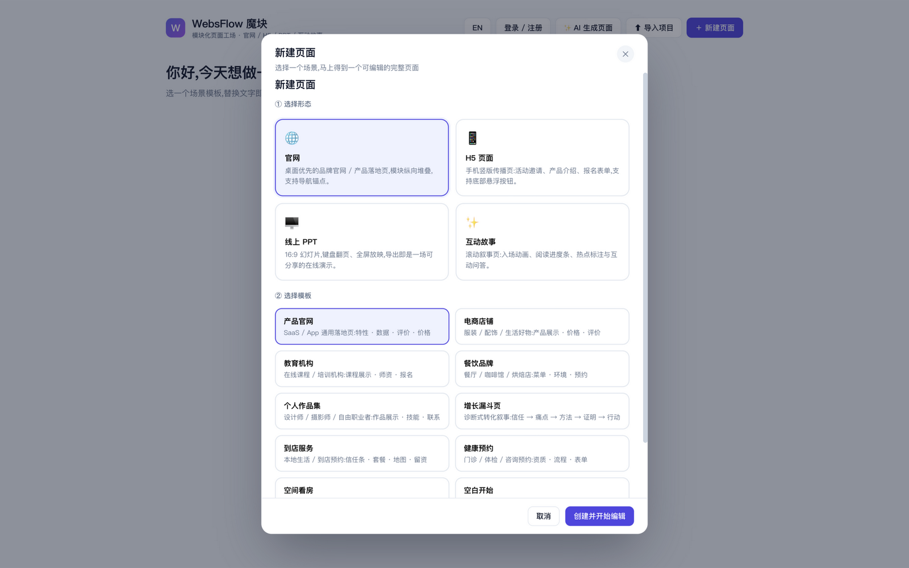

**这是什么**:创建项目的唯一入口,分三步——① 选择形态(官网/H5/线上 PPT/互动故事),② 选择模板(10 套行业成品 + 空白开始),③ 命名。

**怎么用**:

- 形态决定画布比例、可用模块与运行时行为,创建后不可改(如需切换形态,新建后用 JSON 导入搬运内容);
- 模板自带完整文案与配色,选最接近的场景再改字,比空白起步快得多;
- 登录后,向导底部会出现「🌐 云端模板」:别人发布到模板库的页面会列在这里,一键引用。

---

## 二、三栏工作台与顶栏工具

### 编辑器全景


**这是什么**:编辑器三栏布局——左栏是功能面板(模块/大纲/页面/片段/分群/自动化/AI/市场/主题/版本),中间画布所见即所得,右侧检查器展示当前选中模块的全部可编辑字段。

**怎么用**:

- 左栏点击模块即插入画布;画布上点击任意模块,右侧检查器立即出现它的字段表单;
- 画布内每个模块悬停会浮出工具条:上移/下移、复制、删除、收进容器;
- 顶部「● 已保存」是自动保存心跳——改动即存 localStorage,断电不丢。

### 多设备预览:桌面 / 平板 / 手机

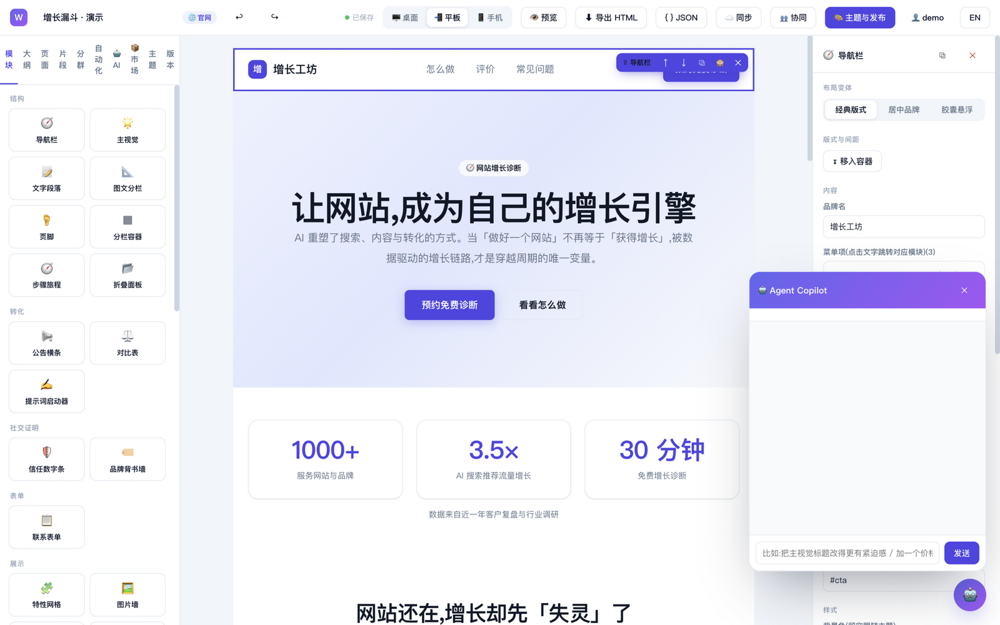

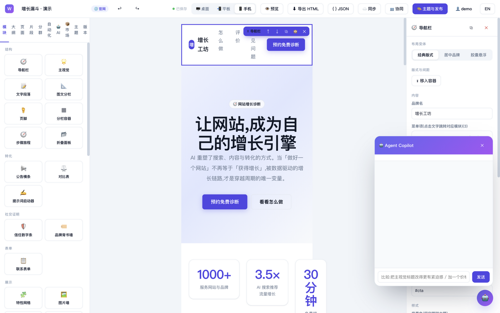

**这是什么**:顶栏设备切换按钮,即时改变画布宽度,模拟目标设备上的渲染效果。

**怎么用**:

- 投放页务必切到「手机」过一遍:H5 形态的画布本身就是手机竖版;
- 设备预览只影响编辑视区,不改变内容;导出页会自适应真实设备。

### 界面语言:中文 / English


**这是什么**:顶栏 EN/中 按钮一键切换界面语言。后台与编辑器全部界面文案均已双语化,内容数据不受影响。

---

## 三、左栏十大面板

### 1. 模块库


**这是什么**:全部内容模块的货架,按「结构 / 转化 / 社交证明 / 表单 / 展示 / 互动 / 幻灯 / 插件」分类。每个模块显示图标、名称与悬停提示。

**怎么用**:点击插入到当前选中模块之后;或直接拖拽到画布目标位置。只显示当前形态可用的模块(如 PPT 形态下会出现「幻灯」分类)。

### 2. 大纲

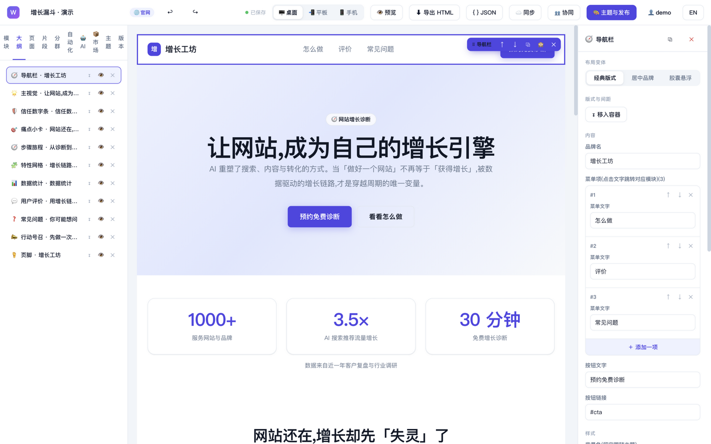

**这是什么**:整页模块的层级列表,等于页面的目录。

**怎么用**:点击条目选中画布模块;拖动排序;条目右侧 ✕ 删除(有确认)。页面模块多时,用它定位比在画布里翻找快。

### 3. 页面(多页站点)

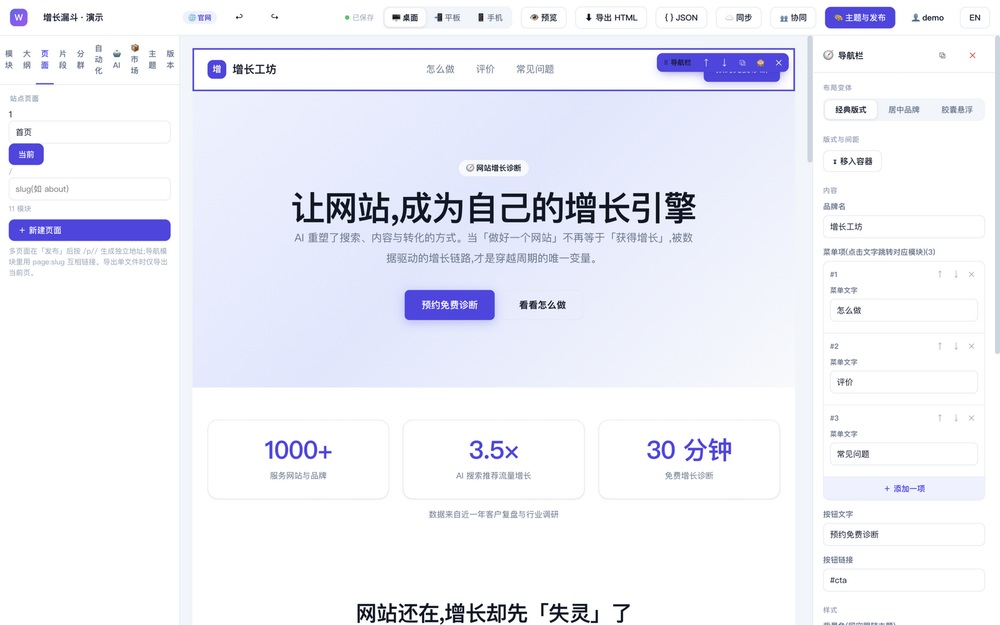

**这是什么**:官网形态支持一个项目多个页面(首页 + 子页),此面板管理页面列表、排序与删除。

**怎么用**:「＋ 添加页面」新建;每页可单独设置 slug(访问地址)与 SEO 信息;托管发布后子页通过 `/webflow/p/<token>/<slug>` 访问。

### 4. 片段(版式预设)

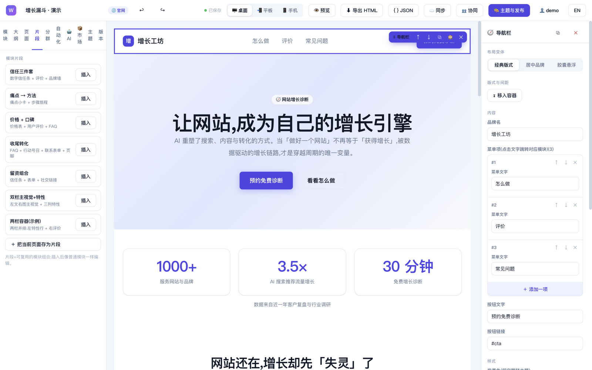

**这是什么**:内置版式预设与自定义片段。内置预设调的是全局版式参数(容器宽度、圆角、阴影等);自定义片段可以把你调好的模块组合存起来复用。

**怎么用**:选中若干模块 → 保存为片段 → 下个项目一键插入;内置预设点一下即生效,可随时撤销。

### 5. 分群(千人千面)


**这是什么**:人群分群管理。分群 = 一组访客判定规则(新老访客、登录态、UTM、设备、国家、时段),建好后可在任意模块上引用,实现块级人群定向。详见[第八节](#八千人千面与分群)。

### 6. 自动化(页面侧旅程)

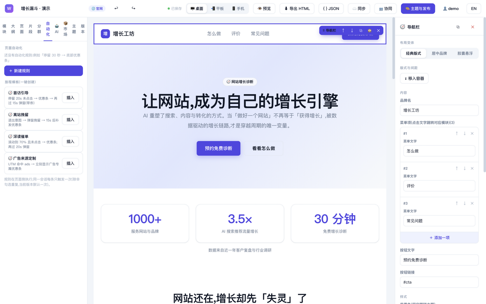

**这是什么**:页面内自动化的编排入口——例如「停留 30 秒后弹出优惠券」「滚动到价格表时高亮 CTA」这类页面侧旅程规则。

**怎么用**:新建规则 → 选触发条件(时间/滚动/点击)→ 配置动作(弹层/高亮/替换文案)→ 保存后导出页自动携带执行逻辑。

### 7. AI 助手

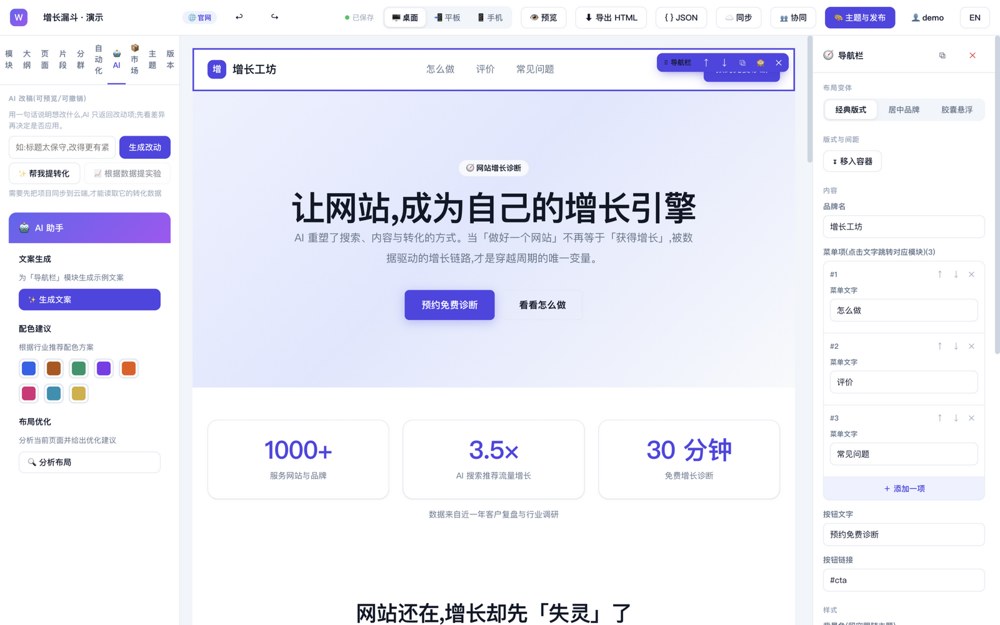

**这是什么**:AI 能力面板:文案改写、整页生成建议、模块补全。需要配置模型供应商;未配置时明确提示降级,不会假装成功。详见[第十二节](#十二ai-能力与任务库)。

### 8. 市场

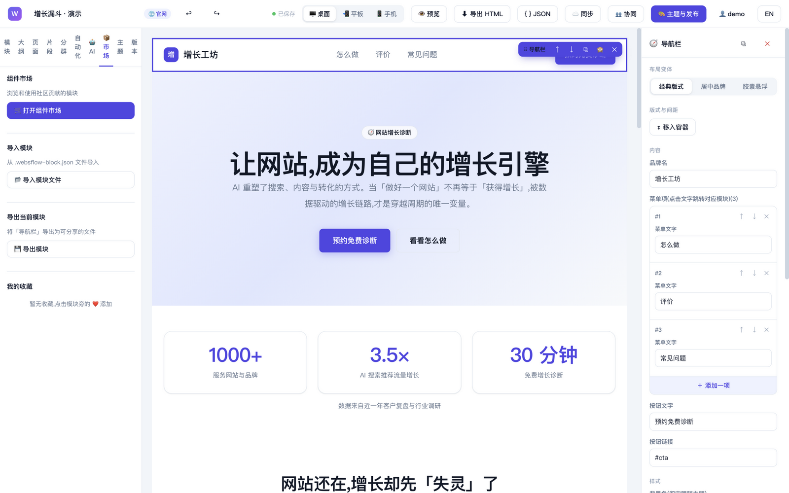

**这是什么**:模块市场入口——浏览/安装社区模块插件,管理已安装插件与收藏。详见[第十三节](#十三开放能力api--mcp--插件)。

### 9. 主题

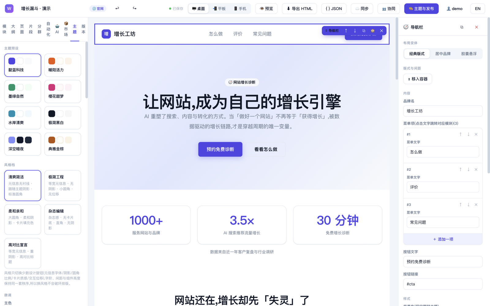

**这是什么**:全局主题:8 套配色预设 + 风格档 + 字体搭配 + 版式参数。详见[第六节](#六主题系统)。

### 10. 版本

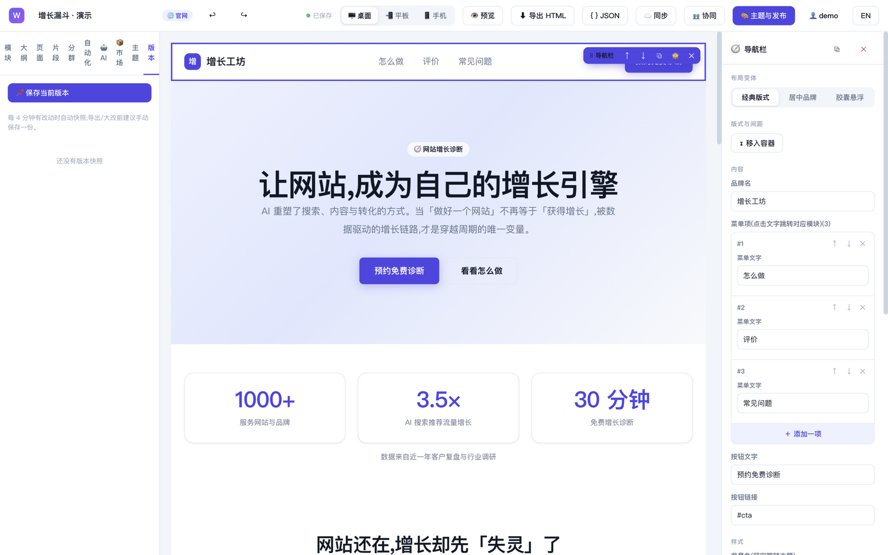

**这是什么**:版本快照列表。每次结构性改动都可以留快照,支持一键回滚。

**怎么用**:大改前手动打一个快照;改坏后进此面板对比并回滚。配合顶栏撤销(⌘Z)使用,小改动撤销、大改动回滚。

---

## 四、内容模块全库

44 个内容模块,按 8 大分类组织。每个模块列出:截图(插入后的画布 + 检查器)、用途、适用形态、布局变体数量、**字段级可编辑项**。字段里的「列表」类型表示可增删多项(每项有自己的子字段)。

> 阅读方式:先看「用途」判断要不要用,再看「布局变体」定样式方向,最后按字段表逐项替换文案。


### 结构

#### 🧭 导航栏 `nav`

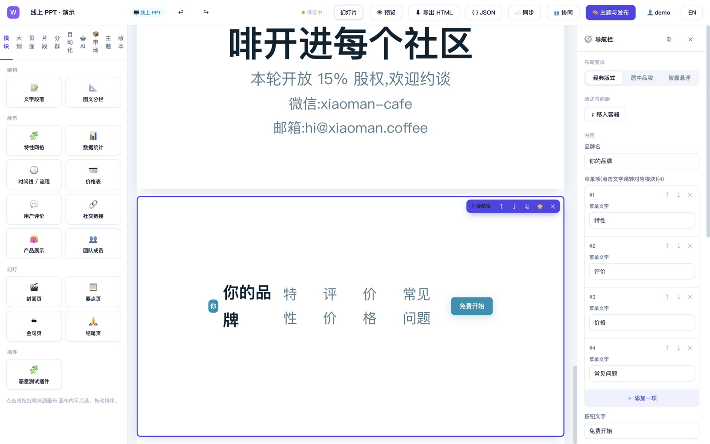

- **用途**:品牌名 + 锚点菜单 + 行动按钮,吸顶显示。
- **适用形态**:官网
- **布局变体**:2 种

| 可编辑字段 | 说明 |
| --- | --- |
| 品牌名 | 文本 |
| 菜单项(点击文字跳转对应模块) | 列表(项:菜单文字) |
| 按钮文字 | 文本 |
| 按钮链接 | 链接 |

#### 🌟 主视觉 `hero`

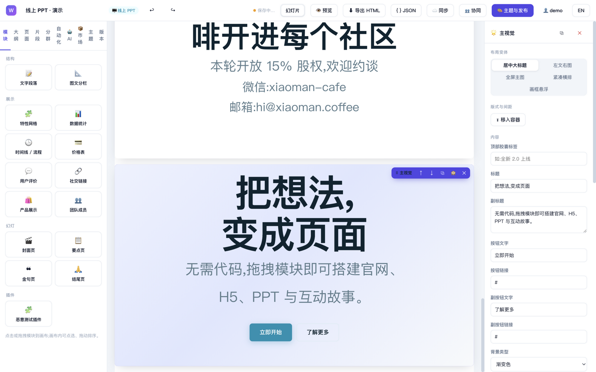

- **用途**:大标题 + 副标题 + 按钮组合,支持渐变或图片背景。
- **适用形态**:官网 / H5 / 故事
- **布局变体**:2 种

| 可编辑字段 | 说明 |
| --- | --- |
| 顶部胶囊标签 | 文本 |
| 标题 | 文本 |
| 副标题 | 多行文本 |
| 按钮文字 | 文本 |
| 按钮链接 | 链接 |
| 副按钮文字 | 文本 |
| 副按钮链接 | 链接 |
| 背景类型 | 选项(渐变色/图片/纯色) |
| 渐变方案 | 选项(靛蓝/日落橙/森林绿/浪漫粉/深空夜/水岸青) |
| 图片 | 图片;提示:背景图片地址,选用后自动加深色遮罩保证文字可读 |
| 对齐 | 选项(居左/居中) |

#### 📝 文字段落 `text`

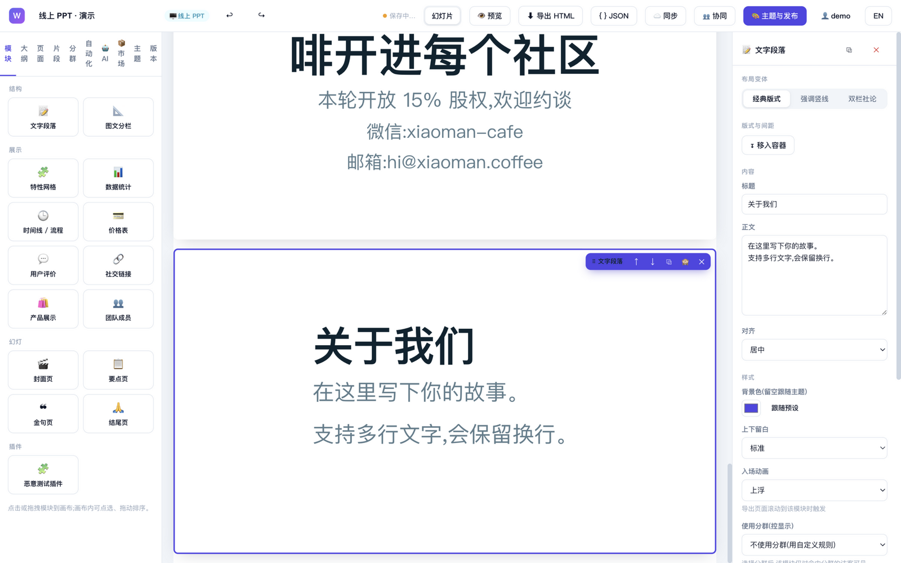

- **用途**:标题 + 多行正文,适合声明、介绍与过渡。
- **适用形态**:官网 / H5 / 故事 / PPT
- **布局变体**:2 种

| 可编辑字段 | 说明 |
| --- | --- |
| 标题 | 文本 |
| 正文 | 多行文本 |
| 对齐 | 选项(居左/居中) |

#### 📐 图文分栏 `split`

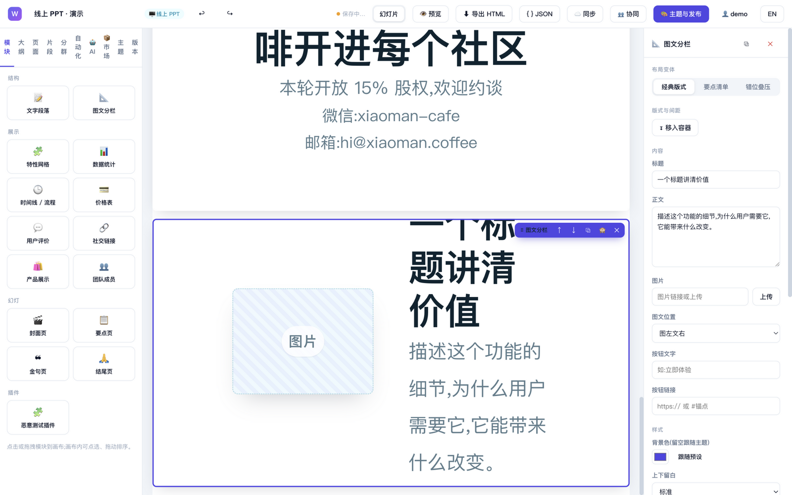

- **用途**:左图右文 / 右图左文,介绍功能与场景。
- **适用形态**:官网 / H5 / 故事 / PPT
- **布局变体**:2 种

| 可编辑字段 | 说明 |
| --- | --- |
| 标题 | 文本 |
| 正文 | 多行文本 |
| 图片 | 图片 |
| 图文位置 | 选项(图左文右/图右文左) |
| 按钮文字 | 文本 |
| 按钮链接 | 链接 |

#### 🦶 页脚 `footer`

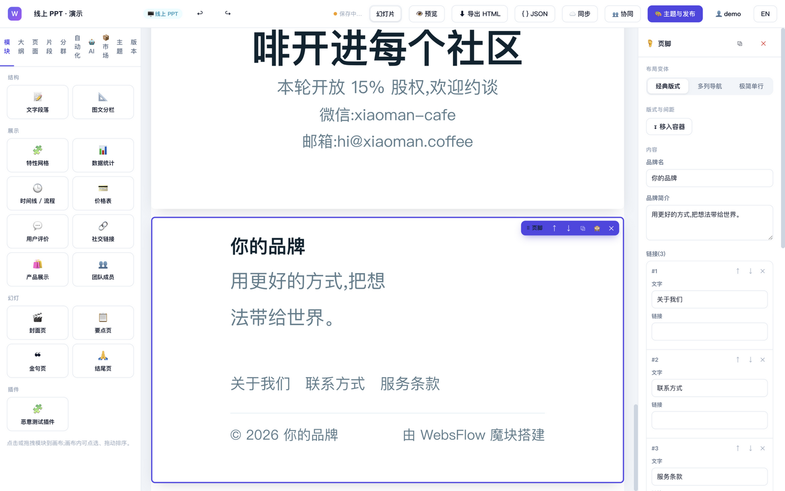

- **用途**:品牌信息、链接与版权声明。
- **适用形态**:官网 / H5
- **布局变体**:2 种

| 可编辑字段 | 说明 |
| --- | --- |
| 品牌名 | 文本 |
| 品牌简介 | 多行文本 |
| 链接 | 列表(项:文字、链接) |
| 版权行 | 文本 |

#### ▦ 分栏容器 `section`

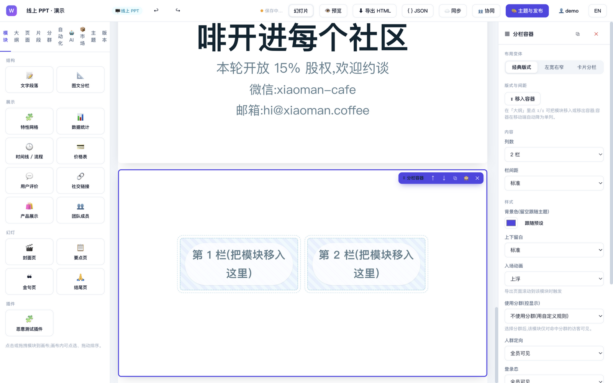

- **用途**:把模块放进 1-3 栏容器里并排布局(拖入/移出在「大纲」面板操作)。
- **适用形态**:官网 / H5 / 故事
- **布局变体**:2 种

| 可编辑字段 | 说明 |
| --- | --- |
| 列数 | 选项(1 栏/2 栏/3 栏) |
| 栏间距 | 选项(紧凑/标准/宽松) |

#### 🧭 步骤旅程 `journey`

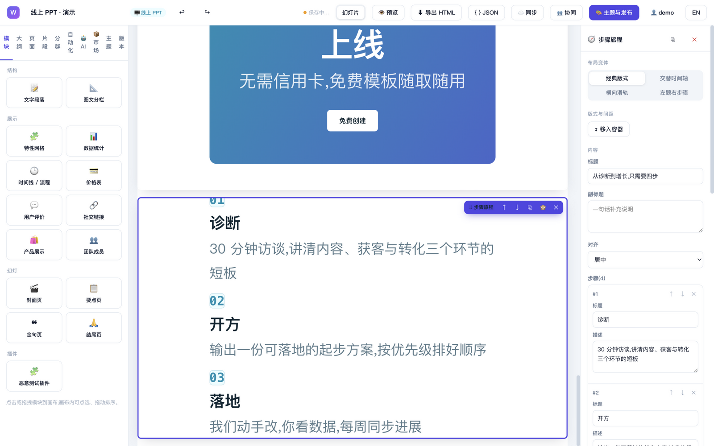

- **用途**:自动编号的步骤条,讲清「先做什么再做什么」。
- **适用形态**:官网 / H5 / 故事
- **布局变体**:3 种

| 可编辑字段 | 说明 |
| --- | --- |
| 标题 | 文本 |
| 副标题 | 多行文本 |
| 对齐 | 选项(居左/居中) |
| 步骤 | 列表(项:标题、描述) |

#### 📂 折叠面板 `accordion`

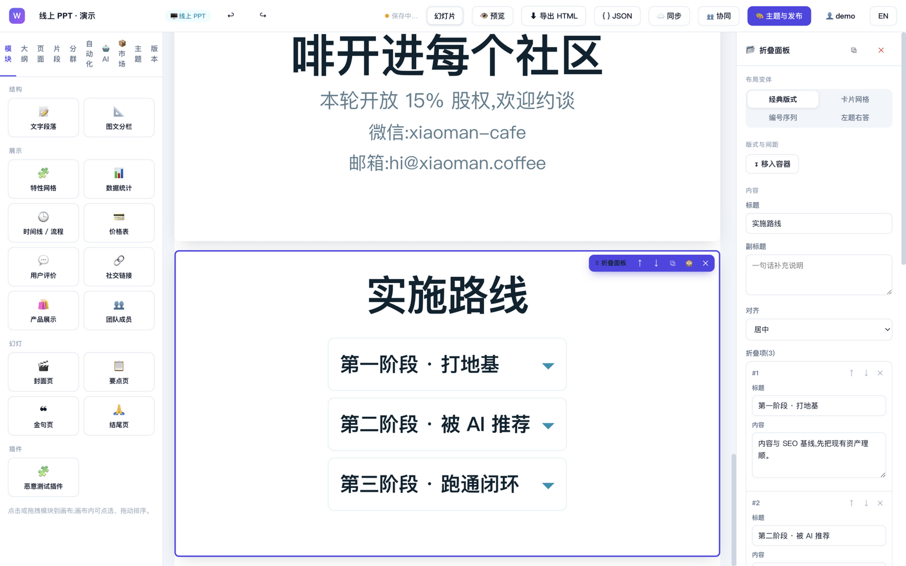

- **用途**:原生 details 折叠面板,零 JS,适合路线图/阶段说明。
- **适用形态**:官网 / H5 / 故事
- **布局变体**:3 种

| 可编辑字段 | 说明 |
| --- | --- |
| 标题 | 文本 |
| 副标题 | 多行文本 |
| 对齐 | 选项(居左/居中) |
| 折叠项 | 列表(项:标题、内容) |


### 展示

#### 🧩 特性网格 `features`

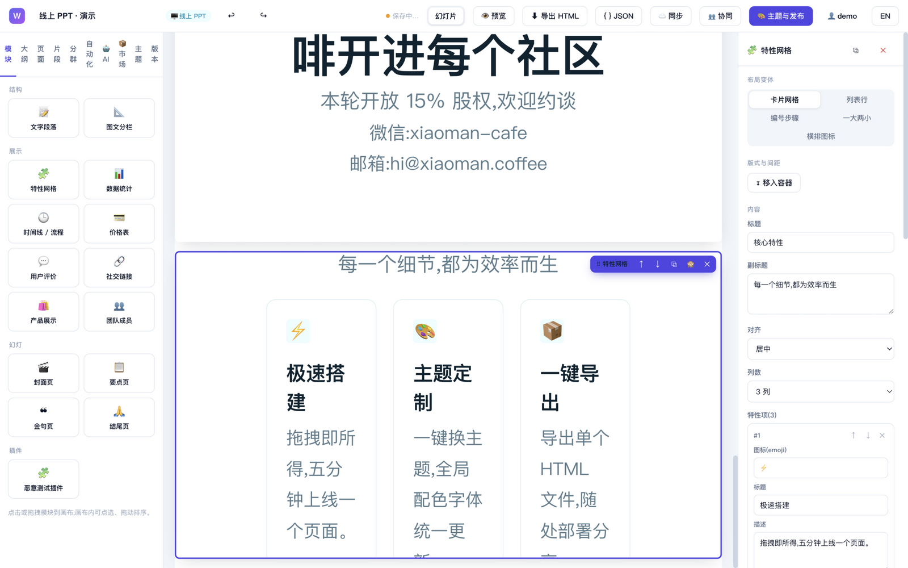

- **用途**:图标 + 标题 + 描述的卡片网格,展示核心能力。
- **适用形态**:官网 / H5 / 故事 / PPT
- **布局变体**:2 种

| 可编辑字段 | 说明 |
| --- | --- |
| 标题 | 文本 |
| 副标题 | 多行文本 |
| 对齐 | 选项(居左/居中) |
| 列数 | 选项(2 列/3 列/4 列) |
| 特性项 | 列表(项:图标(emoji)、标题、描述) |

#### 🖼️ 图片墙 `gallery`

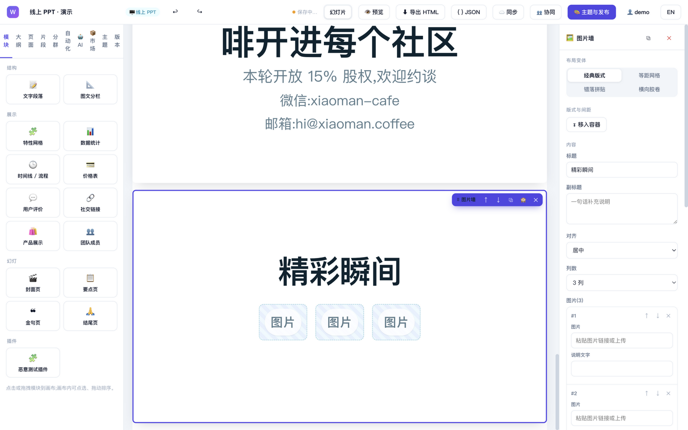

- **用途**:图片网格 + 可选说明文字。
- **适用形态**:官网 / H5 / 故事
- **布局变体**:3 种

| 可编辑字段 | 说明 |
| --- | --- |
| 标题 | 文本 |
| 副标题 | 多行文本 |
| 对齐 | 选项(居左/居中) |
| 列数 | 选项(2 列/3 列/4 列) |
| 图片 | 列表(项:图片、说明文字) |

#### 📊 数据统计 `stats`

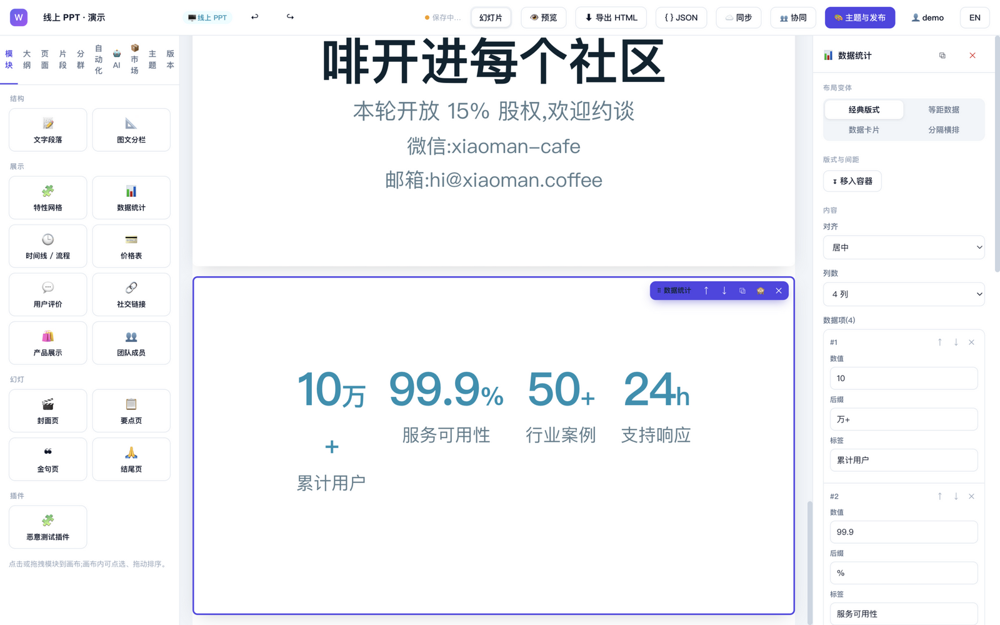

- **用途**:大数字 + 标签,用数据建立信任。
- **适用形态**:官网 / H5 / 故事 / PPT
- **布局变体**:3 种

| 可编辑字段 | 说明 |
| --- | --- |
| 对齐 | 选项(居左/居中) |
| 列数 | 选项(2 列/3 列/4 列) |
| 数据项 | 列表(项:数值、后缀、标签) |

#### 🕒 时间线 / 流程 `timeline`

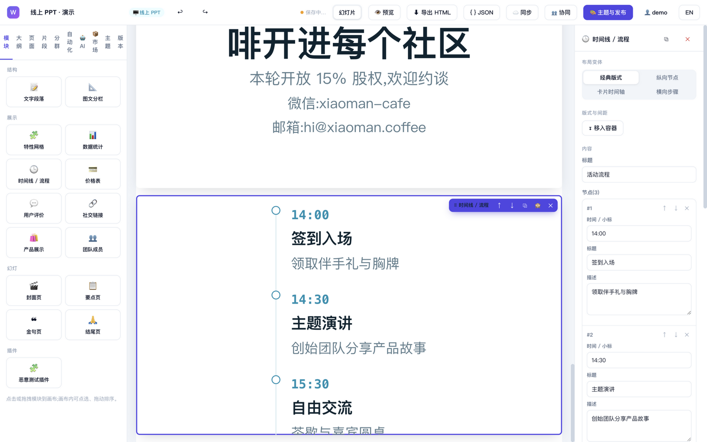

- **用途**:纵向节点列表,讲历程、流程或议程。
- **适用形态**:官网 / H5 / 故事 / PPT
- **布局变体**:3 种

| 可编辑字段 | 说明 |
| --- | --- |
| 标题 | 文本 |
| 节点 | 列表(项:时间 / 小标、标题、描述) |

#### 💳 价格表 `pricing`

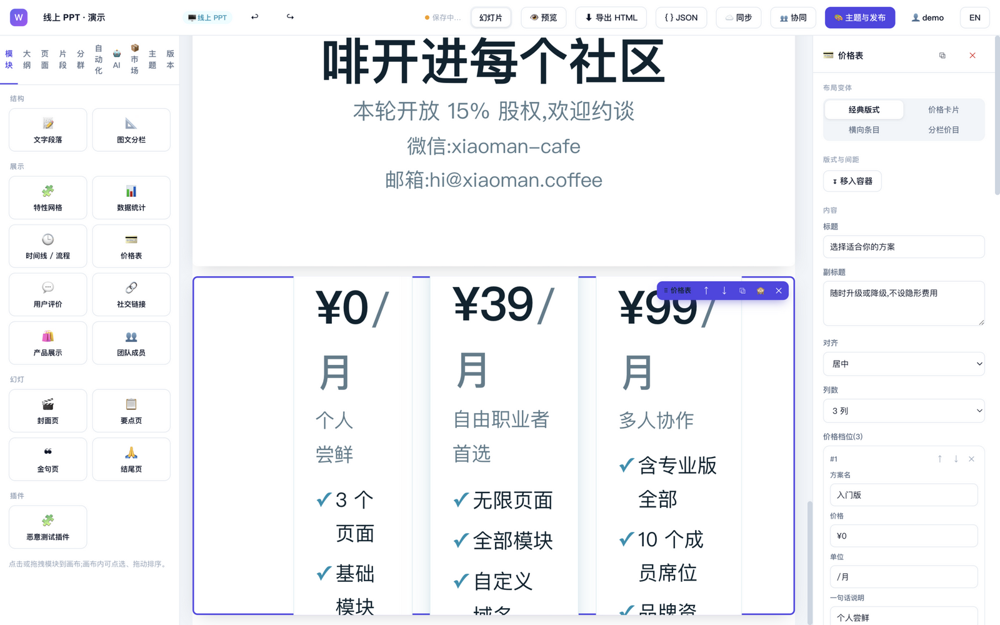

- **用途**:多档价格卡片,支持推荐标记。
- **适用形态**:官网 / H5 / PPT
- **布局变体**:3 种

| 可编辑字段 | 说明 |
| --- | --- |
| 标题 | 文本 |
| 副标题 | 多行文本 |
| 对齐 | 选项(居左/居中) |
| 列数 | 选项(2 列/3 列) |
| 价格档位 | 列表(项:方案名、价格、单位、一句话说明、包含内容(每行一条)、角标、高亮推荐、按钮文字) |

#### 💬 用户评价 `testimonials`

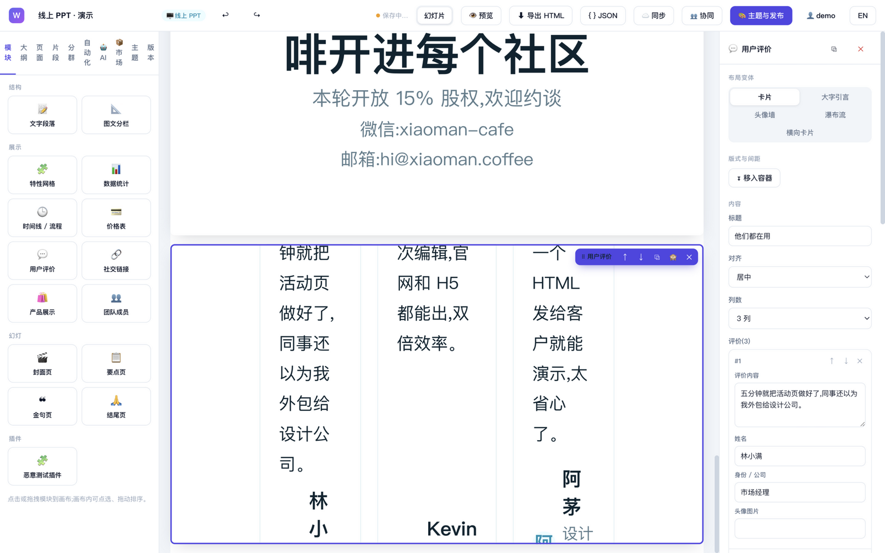

- **用途**:引用式评价卡片,附头像与身份。
- **适用形态**:官网 / H5 / PPT
- **布局变体**:2 种

| 可编辑字段 | 说明 |
| --- | --- |
| 标题 | 文本 |
| 对齐 | 选项(居左/居中) |
| 列数 | 选项(2 列/3 列) |
| 评价 | 列表(项:评价内容、姓名、身份 / 公司、头像图片) |

#### ❓ 常见问题 `faq`

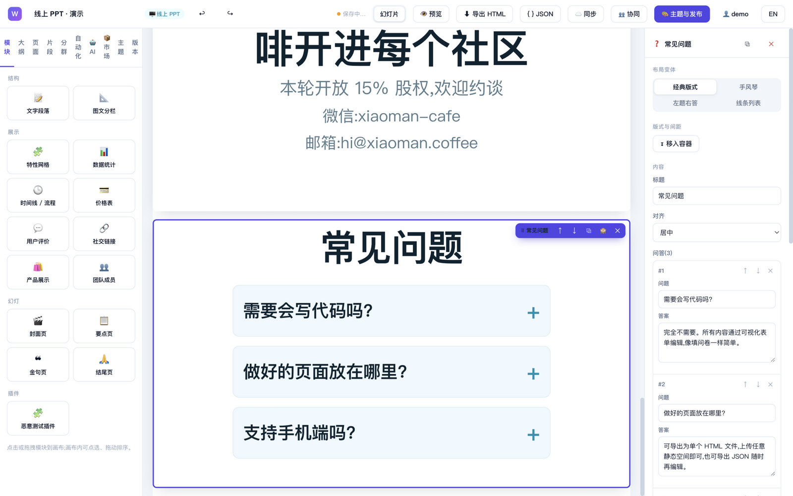

- **用途**:可展开的手风琴问答。
- **适用形态**:官网 / H5 / 故事
- **布局变体**:3 种

| 可编辑字段 | 说明 |
| --- | --- |
| 标题 | 文本 |
| 对齐 | 选项(居左/居中) |
| 问答 | 列表(项:问题、答案) |

#### 📣 行动号召 `cta`

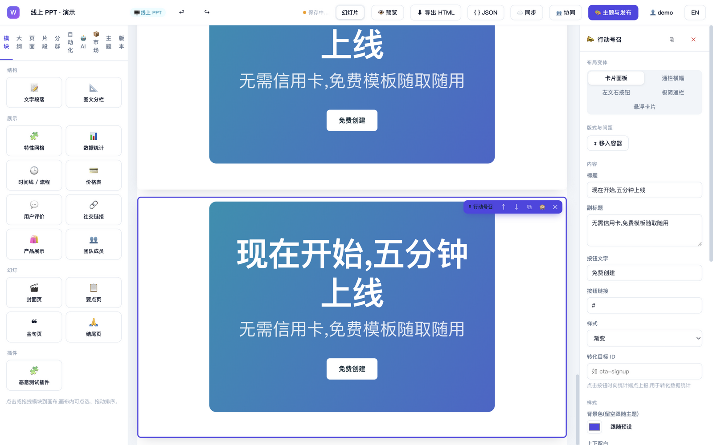

- **用途**:高亮横幅,引导用户注册、购买或报名。
- **适用形态**:官网 / H5 / 故事
- **布局变体**:2 种

| 可编辑字段 | 说明 |
| --- | --- |
| 标题 | 文本 |
| 副标题 | 多行文本 |
| 按钮文字 | 文本 |
| 按钮链接 | 链接 |
| 样式 | 选项(主题色/渐变/浅色卡片) |
| 转化目标 ID | 文本;提示:点击按钮时向统计端点上报,用于转化数据统计 |

#### 🎬 视频 `video`

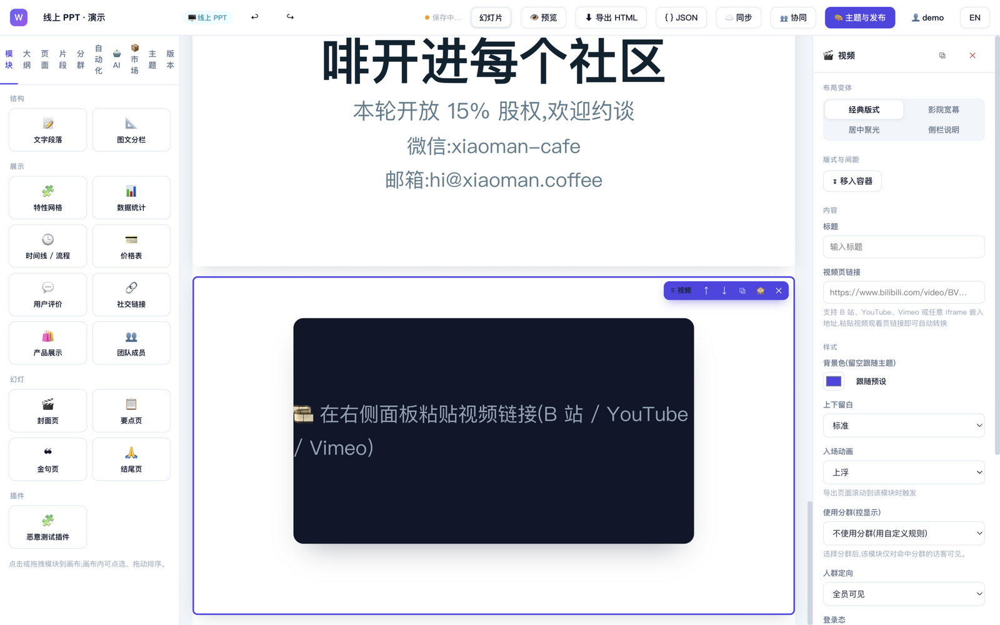

- **用途**:嵌入 B 站 / 抖音 / YouTube 等平台视频。
- **适用形态**:官网 / H5 / 故事
- **布局变体**:3 种

| 可编辑字段 | 说明 |
| --- | --- |
| 标题 | 文本 |
| 视频页链接 | 链接;提示:支持 B 站、YouTube、Vimeo 或任意 iframe 嵌入地址,粘贴视频观看页链接即可自动转换 |

#### 🗂️ 选项卡 `tabs`

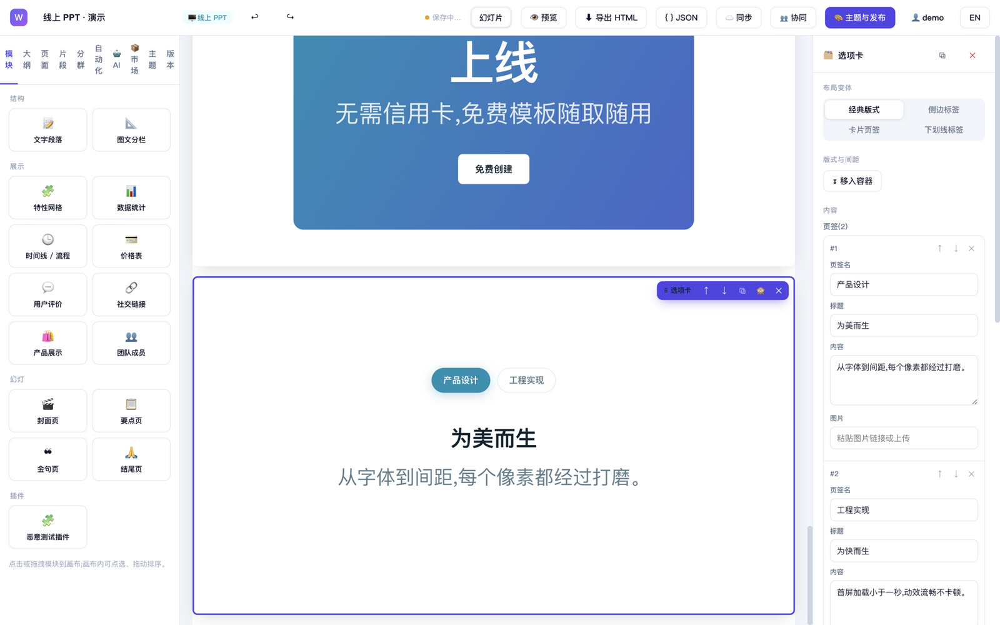

- **用途**:多页签切换展示不同内容。
- **适用形态**:官网 / 故事
- **布局变体**:3 种

| 可编辑字段 | 说明 |
| --- | --- |
| 页签 | 列表(项:页签名、标题、内容、图片) |

#### 🗺️ 地图 `map`

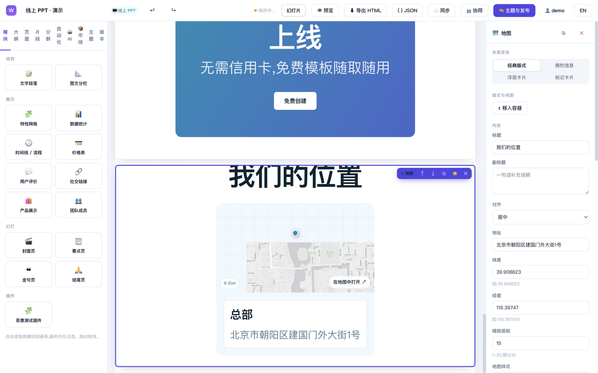

- **用途**:显示位置的地图,支持标记点和信息窗口。
- **适用形态**:官网 / H5 / 故事
- **布局变体**:3 种

| 可编辑字段 | 说明 |
| --- | --- |
| 标题 | 文本 |
| 副标题 | 多行文本 |
| 对齐 | 选项(居左/居中) |
| 地址 | 文本 |
| 纬度 | 数字;提示:如:39.908823 |
| 经度 | 数字;提示:如:116.397470 |
| 缩放级别 | 数字;提示:1-20,默认15 |
| 地图样式 | 选项(简约浅灰(推荐)/卫星影像/街道/地形/OpenStreetMap);提示:中国区街道/地形在高缩放级别可能无数据,建议用浅灰或卫星 |
| 自定义瓦片地址(高级) | 文本;提示:留空使用内置样式;支持 {z}/{x}/{y} 占位,如自建/代理瓦片服务 |
| 标记点 | 列表(项:名称、地址、纬度、经度) |

#### 🔗 社交链接 `social`

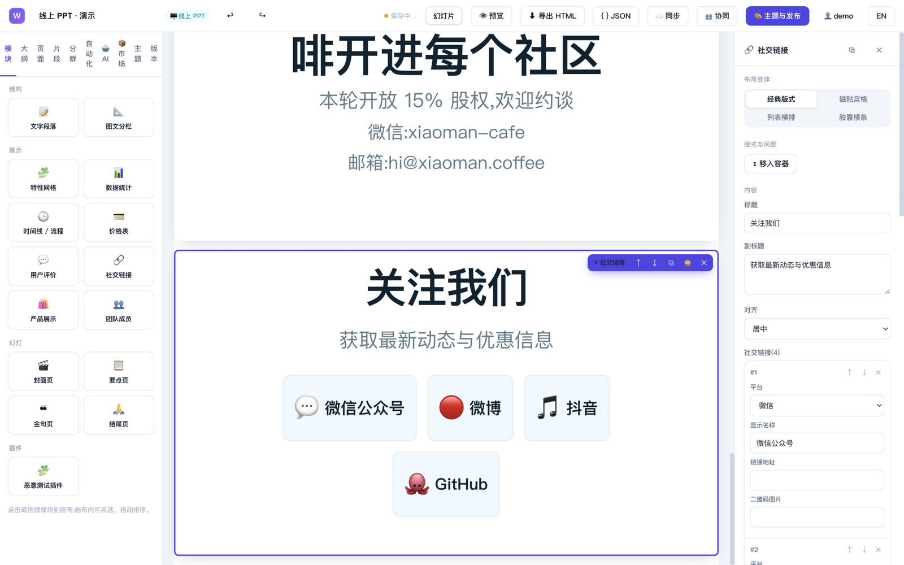

- **用途**:社交媒体图标链接:微信、微博、抖音、GitHub 等。
- **适用形态**:官网 / H5 / 故事 / PPT
- **布局变体**:3 种

| 可编辑字段 | 说明 |
| --- | --- |
| 标题 | 文本 |
| 副标题 | 多行文本 |
| 对齐 | 选项(居左/居中) |
| 社交链接 | 列表(项:平台、显示名称、链接地址、二维码图片) |

#### 📰 博客文章 `blog`

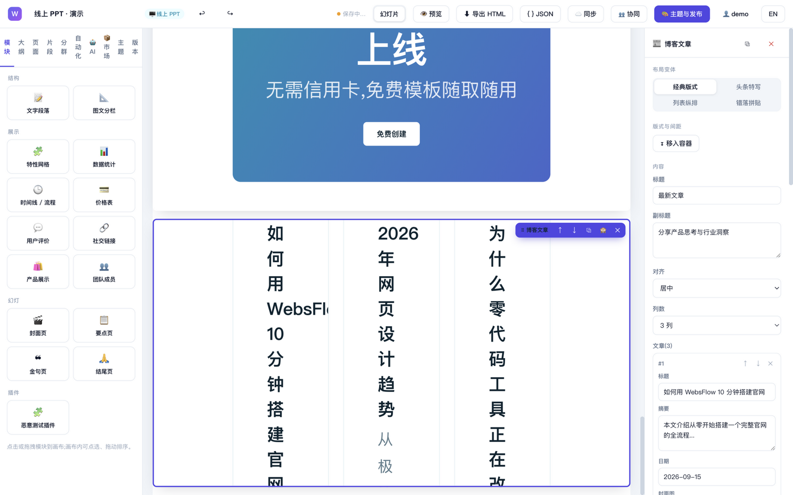

- **用途**:文章列表:标题、摘要、日期与封面图。
- **适用形态**:官网 / 故事
- **布局变体**:3 种

| 可编辑字段 | 说明 |
| --- | --- |
| 标题 | 文本 |
| 副标题 | 多行文本 |
| 对齐 | 选项(居左/居中) |
| 列数 | 选项(2 列/3 列) |
| 文章 | 列表(项:标题、摘要、日期、封面图、分类) |

#### 🛍️ 产品展示 `product-showcase`

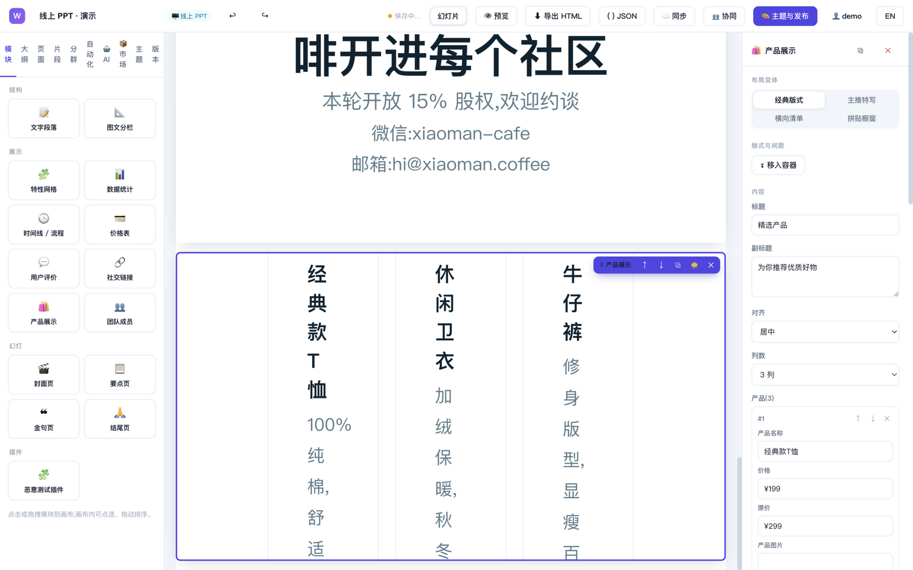

- **用途**:产品卡片:图片、名称、价格与购买按钮。
- **适用形态**:官网 / H5 / 故事 / PPT
- **布局变体**:3 种

| 可编辑字段 | 说明 |
| --- | --- |
| 标题 | 文本 |
| 副标题 | 多行文本 |
| 对齐 | 选项(居左/居中) |
| 列数 | 选项(2 列/3 列/4 列) |
| 产品 | 列表(项:产品名称、价格、原价、产品图片、角标、简短描述) |
| 按钮文字 | 文本 |

#### 👥 团队成员 `team`

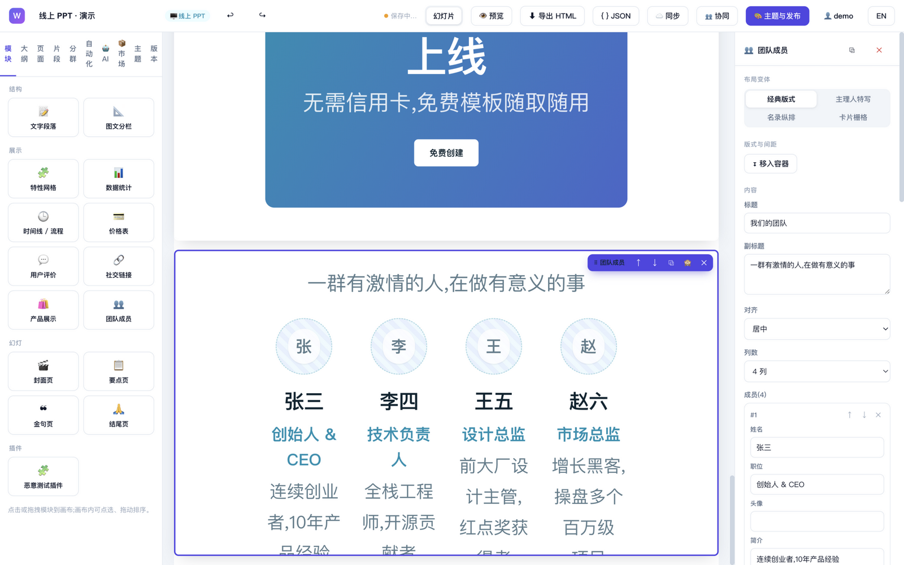

- **用途**:团队介绍:头像、姓名、职位与简介。
- **适用形态**:官网 / 故事 / PPT
- **布局变体**:3 种

| 可编辑字段 | 说明 |
| --- | --- |
| 标题 | 文本 |
| 副标题 | 多行文本 |
| 对齐 | 选项(居左/居中) |
| 列数 | 选项(3 列/4 列) |
| 成员 | 列表(项:姓名、职位、头像、简介) |

#### 🎯 痛点小卡 `cluster`

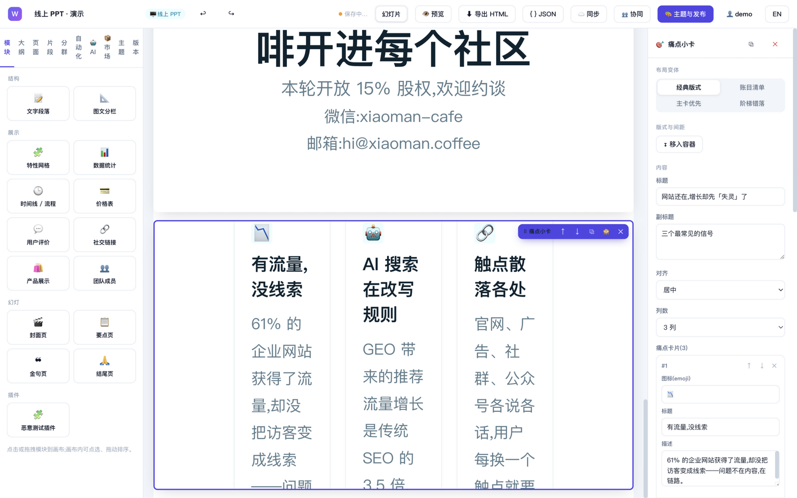

- **用途**:密集的小卡片阵,每条都是「标题 + 归因描述」的痛点表达。
- **适用形态**:官网 / H5 / 故事
- **布局变体**:3 种

| 可编辑字段 | 说明 |
| --- | --- |
| 标题 | 文本 |
| 副标题 | 多行文本 |
| 对齐 | 选项(居左/居中) |
| 列数 | 选项(2 列/3 列/4 列) |
| 痛点卡片 | 列表(项:图标(emoji)、标题、描述) |

#### 🎞️ 滚动横幅 `marquee`

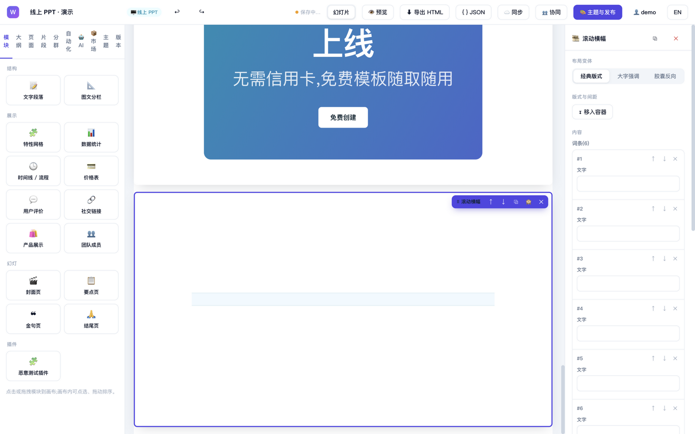

- **用途**:无缝滚动的词条横幅,悬停暂停,适合能力/关键词列表。
- **适用形态**:官网 / H5 / 故事
- **布局变体**:2 种

| 可编辑字段 | 说明 |
| --- | --- |
| 词条 | 列表(项:文字) |

#### 🍱 Bento 网格 `bento`

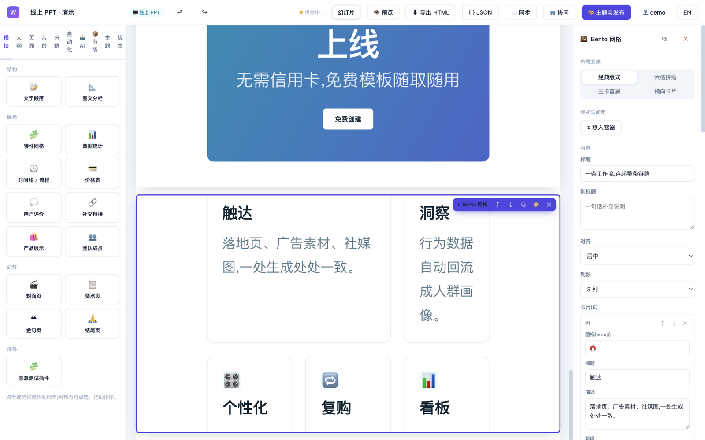

- **用途**:不等宽的拼贴网格:大卡讲主线,小卡讲细节。
- **适用形态**:官网 / H5 / 故事
- **布局变体**:3 种

| 可编辑字段 | 说明 |
| --- | --- |
| 标题 | 文本 |
| 副标题 | 多行文本 |
| 对齐 | 选项(居左/居中) |
| 列数 | 选项(2 列/3 列/4 列) |
| 卡片 | 列表(项:图标(emoji)、标题、描述、跨度、图片) |

#### 🪄 前后对比 `before-after`

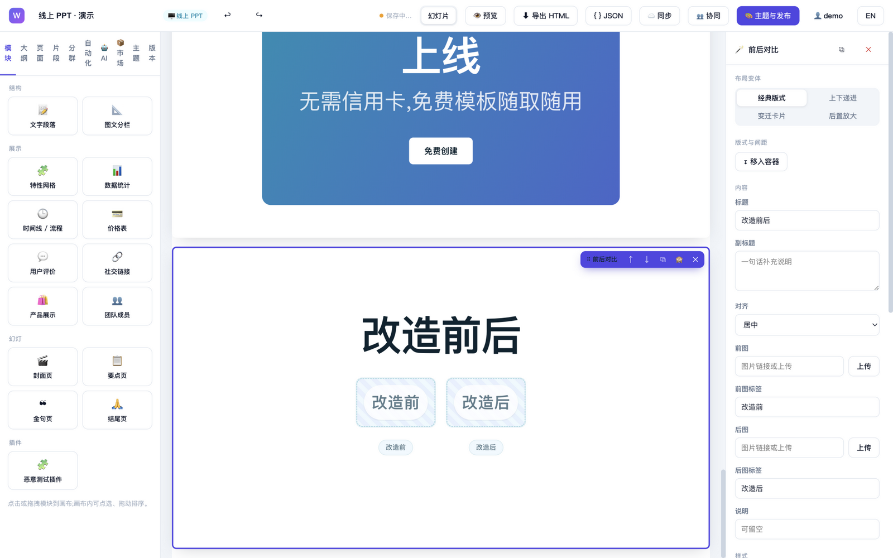

- **用途**:改造前 / 改造后两张图并排,直观呈现效果。
- **适用形态**:官网 / H5 / 故事
- **布局变体**:3 种

| 可编辑字段 | 说明 |
| --- | --- |
| 标题 | 文本 |
| 副标题 | 多行文本 |
| 对齐 | 选项(居左/居中) |
| 前图 | 图片 |
| 前图标签 | 文本 |
| 后图 | 图片 |
| 后图标签 | 文本 |
| 说明 | 文本 |

#### 🧰 工具网格 `tool-grid`

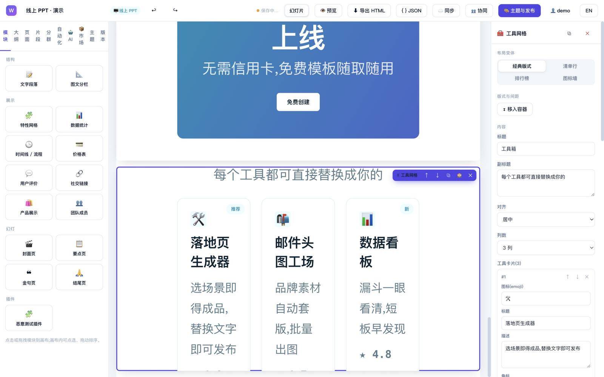

- **用途**:工具卡阵:图标 + 标签 + ★ 评分,适合产品矩阵/功能总览。
- **适用形态**:官网 / H5 / 故事
- **布局变体**:3 种

| 可编辑字段 | 说明 |
| --- | --- |
| 标题 | 文本 |
| 副标题 | 多行文本 |
| 对齐 | 选项(居左/居中) |
| 列数 | 选项(2 列/3 列/4 列) |
| 工具卡片 | 列表(项:图标(emoji)、标题、描述、角标、评分) |

#### 🃏 竖版卡片 `portrait`

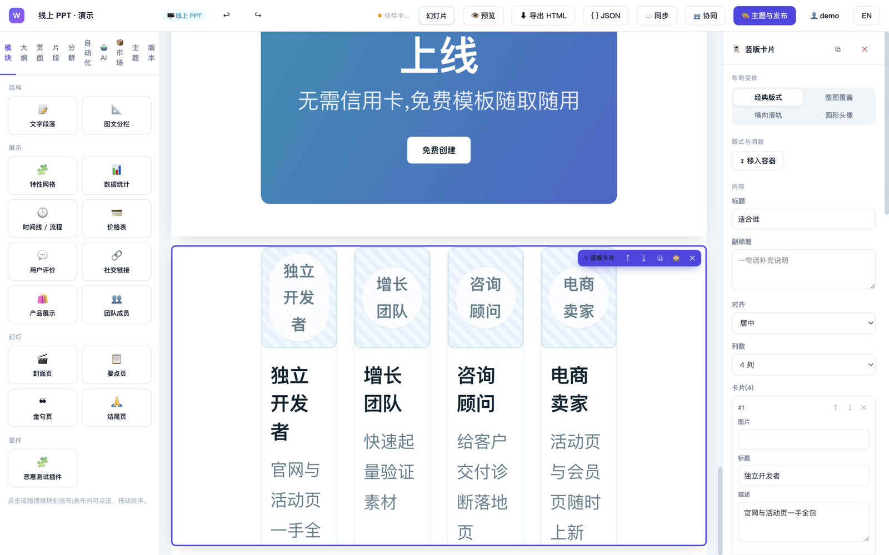

- **用途**:竖版 3:4 图卡的网格,适合人群/场景/案例。
- **适用形态**:官网 / H5 / 故事
- **布局变体**:3 种

| 可编辑字段 | 说明 |
| --- | --- |
| 标题 | 文本 |
| 副标题 | 多行文本 |
| 对齐 | 选项(居左/居中) |
| 列数 | 选项(3 列/4 列) |
| 卡片 | 列表(项:图片、标题、描述) |

#### 🔢 编号展示 `showcase`

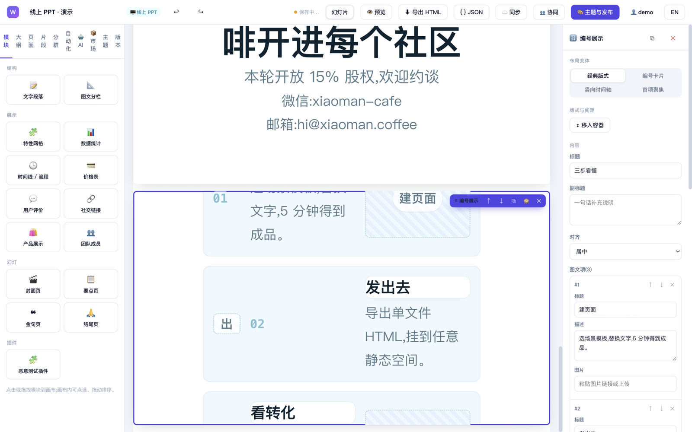

- **用途**:图文交错的自动编号展示,讲「三步看懂」最合适。
- **适用形态**:官网 / H5 / 故事
- **布局变体**:3 种

| 可编辑字段 | 说明 |
| --- | --- |
| 标题 | 文本 |
| 副标题 | 多行文本 |
| 对齐 | 选项(居左/居中) |
| 图文项 | 列表(项:标题、描述、图片) |

#### 📜 更新日志 `changelog`

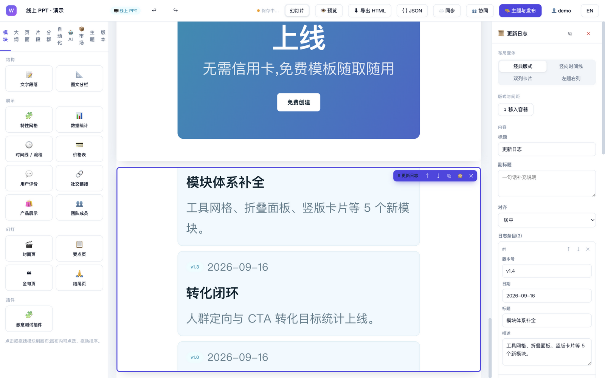

- **用途**:版本历史卡列表,让用户看到产品在持续进化。
- **适用形态**:官网 / H5 / 故事
- **布局变体**:3 种

| 可编辑字段 | 说明 |
| --- | --- |
| 标题 | 文本 |
| 副标题 | 多行文本 |
| 对齐 | 选项(居左/居中) |
| 日志条目 | 列表(项:版本号、日期、标题、描述) |


### 表单

#### 📋 联系表单 `form`

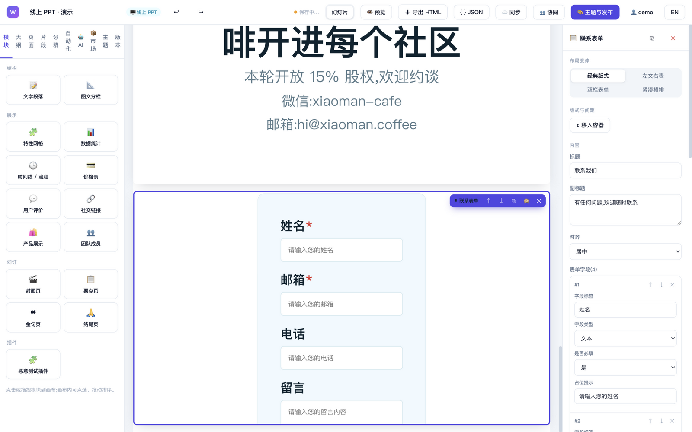

- **用途**:收集用户信息的表单:姓名、邮箱、留言等。
- **适用形态**:官网 / H5 / 故事
- **布局变体**:3 种

| 可编辑字段 | 说明 |
| --- | --- |
| 标题 | 文本 |
| 副标题 | 多行文本 |
| 对齐 | 选项(居左/居中) |
| 表单字段 | 列表(项:字段标签、字段类型、是否必填、占位提示) |
| 提交按钮文字 | 文本 |
| 成功提示 | 文本 |


### 社交证明

#### 🛡️ 信任数字条 `proof`

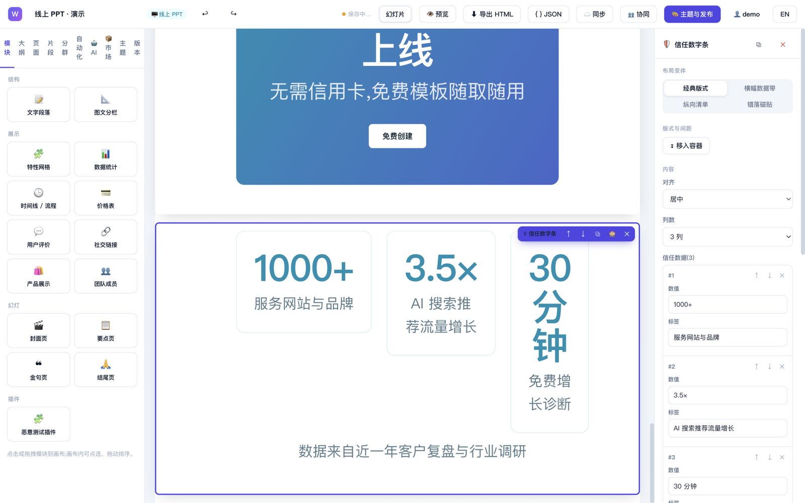

- **用途**:数字 + 说明的信任条,放 hero 下方建立第一屏信任。
- **适用形态**:官网 / H5 / 故事
- **布局变体**:3 种

| 可编辑字段 | 说明 |
| --- | --- |
| 对齐 | 选项(居左/居中) |
| 列数 | 选项(2 列/3 列/4 列) |
| 信任数据 | 列表(项:数值、标签) |
| 备注 | 文本 |

#### 🏷️ 品牌背书墙 `logo-wall`

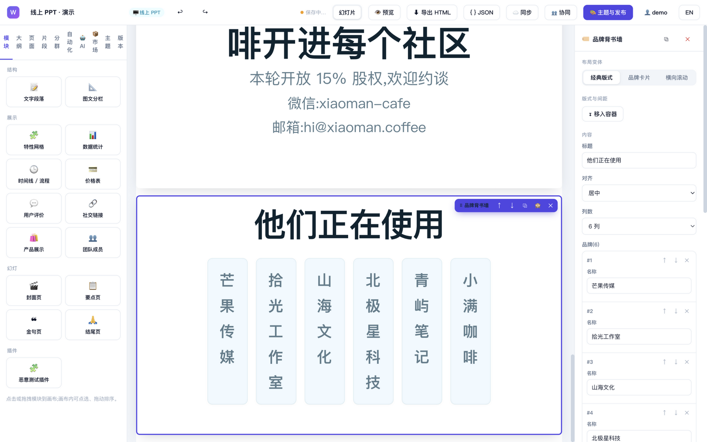

- **用途**:客户/合作品牌的文字 Logo 墙,零图片依赖。
- **适用形态**:官网 / H5 / 故事
- **布局变体**:2 种

| 可编辑字段 | 说明 |
| --- | --- |
| 标题 | 文本 |
| 对齐 | 选项(居左/居中) |
| 列数 | 选项(4 列/5 列/6 列) |
| 品牌 | 列表(项:名称) |


### 转化

#### 📢 公告横条 `banner`

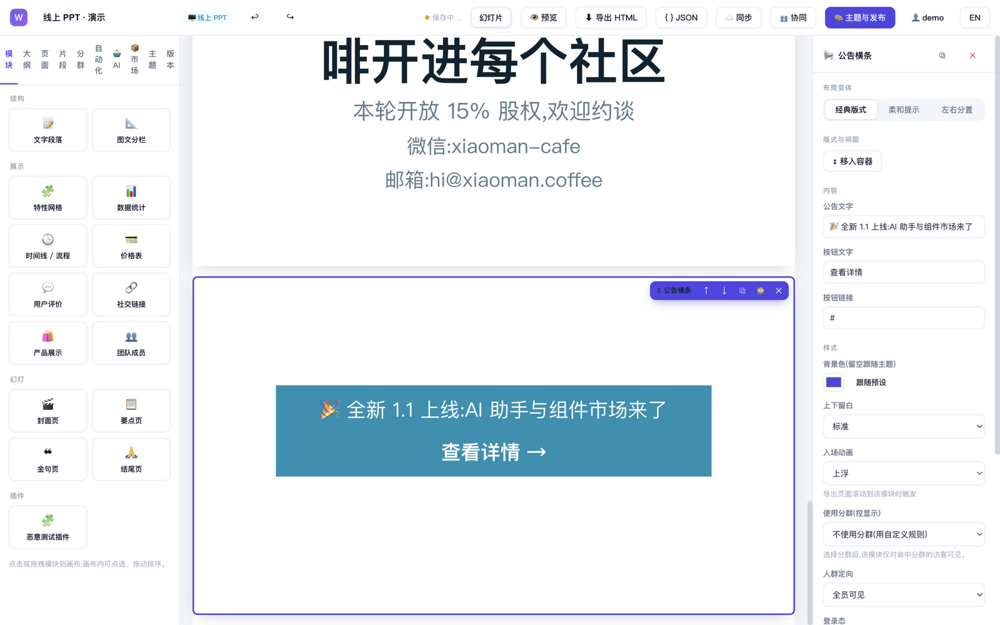

- **用途**:置顶公告条:新品、活动、限时信息,可带跳转链接。
- **适用形态**:官网 / H5 / 故事
- **布局变体**:2 种

| 可编辑字段 | 说明 |
| --- | --- |
| 公告文字 | 文本 |
| 按钮文字 | 文本 |
| 按钮链接 | 链接 |

#### ⚖️ 对比表 `comparison`

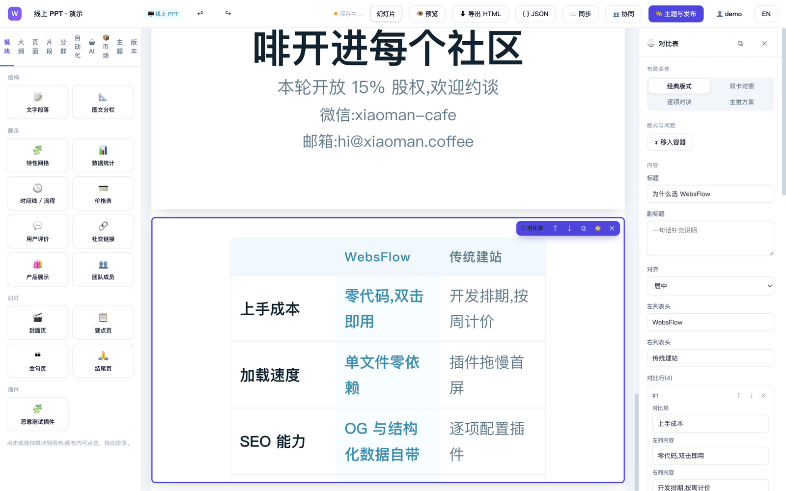

- **用途**:左右两列对比:我们 vs 传统方式,帮访客快速决策。
- **适用形态**:官网 / H5 / 故事
- **布局变体**:3 种

| 可编辑字段 | 说明 |
| --- | --- |
| 标题 | 文本 |
| 副标题 | 多行文本 |
| 对齐 | 选项(居左/居中) |
| 左列表头 | 文本 |
| 右列表头 | 文本 |
| 对比行 | 列表(项:对比项、左列内容、右列内容) |

#### ✍️ 提示词启动器 `prompt`

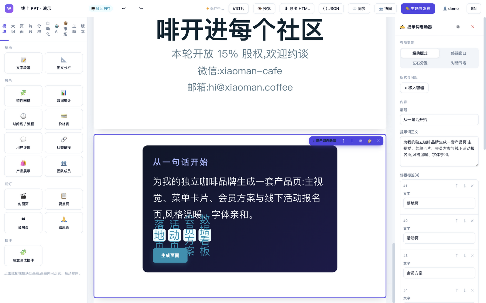

- **用途**:深色卡片展示一条示例提示词 + 场景标签,适合 AI 产品演示。
- **适用形态**:官网 / H5 / 故事
- **布局变体**:3 种

| 可编辑字段 | 说明 |
| --- | --- |
| 眉题 | 文本 |
| 提示词正文 | 多行文本 |
| 场景标签 | 列表(项:文字) |
| 按钮文字 | 文本 |
| 按钮链接 | 链接 |


### 互动

#### ⏳ 倒计时 `countdown`

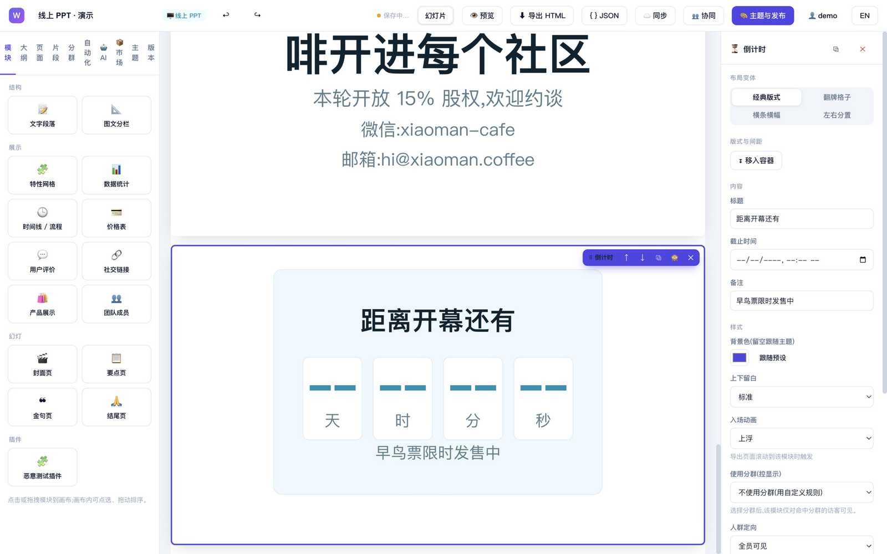

- **用途**:活动截止倒计时,自动走秒。
- **适用形态**:官网 / H5 / 故事
- **布局变体**:3 种

| 可编辑字段 | 说明 |
| --- | --- |
| 标题 | 文本 |
| 截止时间 | 时间 |
| 备注 | 文本 |

#### 🎯 互动问答 `quiz`

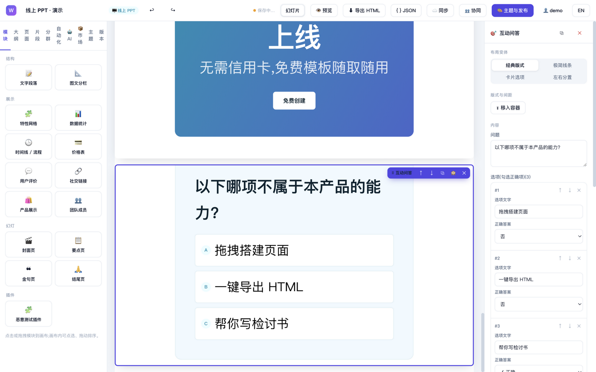

- **用途**:单选题:点击作答,即时判定对错并显示解析。
- **适用形态**:官网 / H5 / 故事
- **布局变体**:3 种

| 可编辑字段 | 说明 |
| --- | --- |
| 问题 | 多行文本 |
| 选项(勾选正确项) | 列表(项:选项文字、正确答案) |
| 答案解析 | 多行文本 |

#### 📍 图片热点 `hotspot`

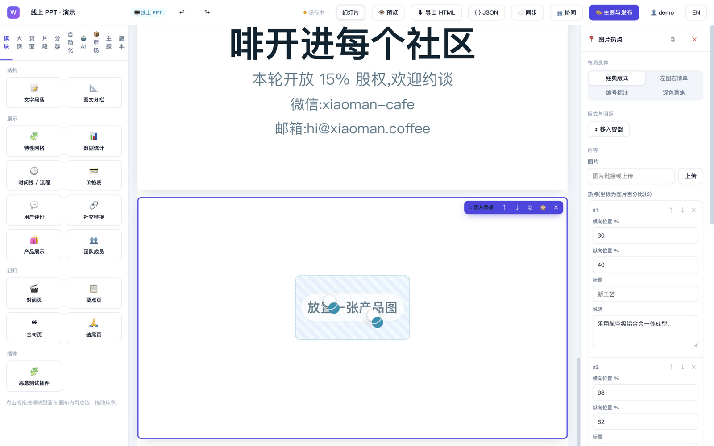

- **用途**:在图片上放置可点击的标注点,讲产品细节。
- **适用形态**:官网 / 故事 / H5
- **布局变体**:3 种

| 可编辑字段 | 说明 |
| --- | --- |
| 图片 | 图片 |
| 热点(坐标为图片百分比) | 列表(项:横向位置 %、纵向位置 %、标题、说明) |


### 幻灯

#### 🎬 封面页 `slide-title`

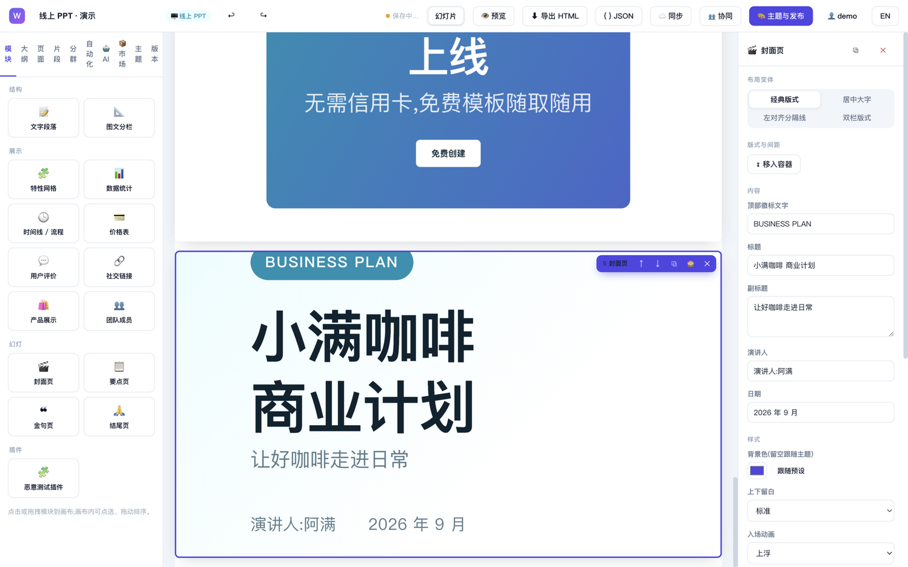

- **用途**:演示封面:主标题 + 演讲人与日期。
- **适用形态**:PPT
- **布局变体**:3 种

| 可编辑字段 | 说明 |
| --- | --- |
| 顶部徽标文字 | 文本 |
| 标题 | 文本 |
| 副标题 | 多行文本 |
| 演讲人 | 文本 |
| 日期 | 文本 |

#### 📋 要点页 `slide-bullets`

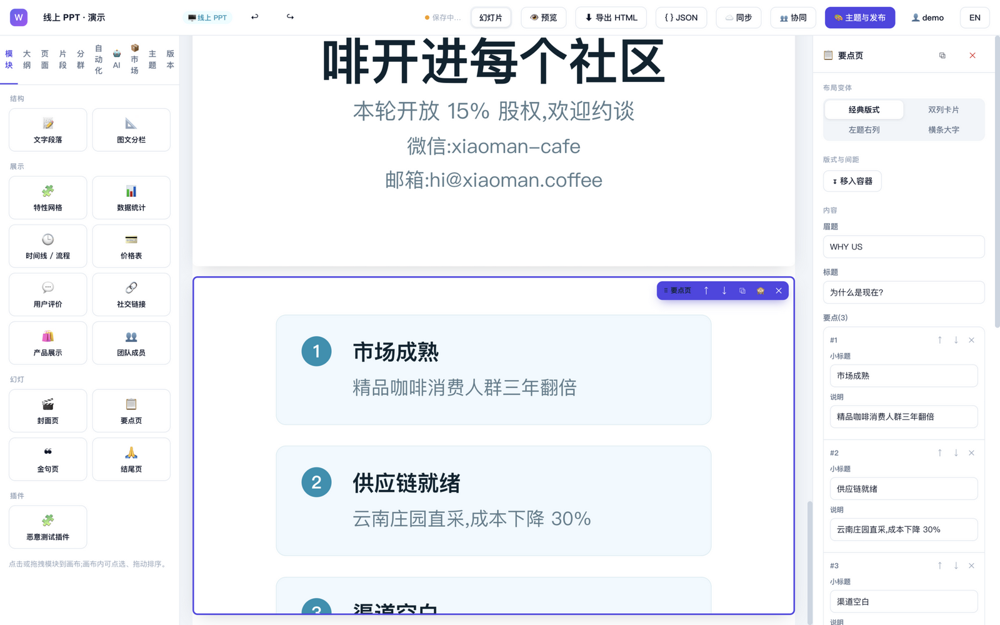

- **用途**:编号要点列表,陈述论据与计划。
- **适用形态**:PPT
- **布局变体**:3 种

| 可编辑字段 | 说明 |
| --- | --- |
| 眉题 | 文本 |
| 标题 | 文本 |
| 要点 | 列表(项:小标题、说明) |

#### ❝ 金句页 `slide-quote`

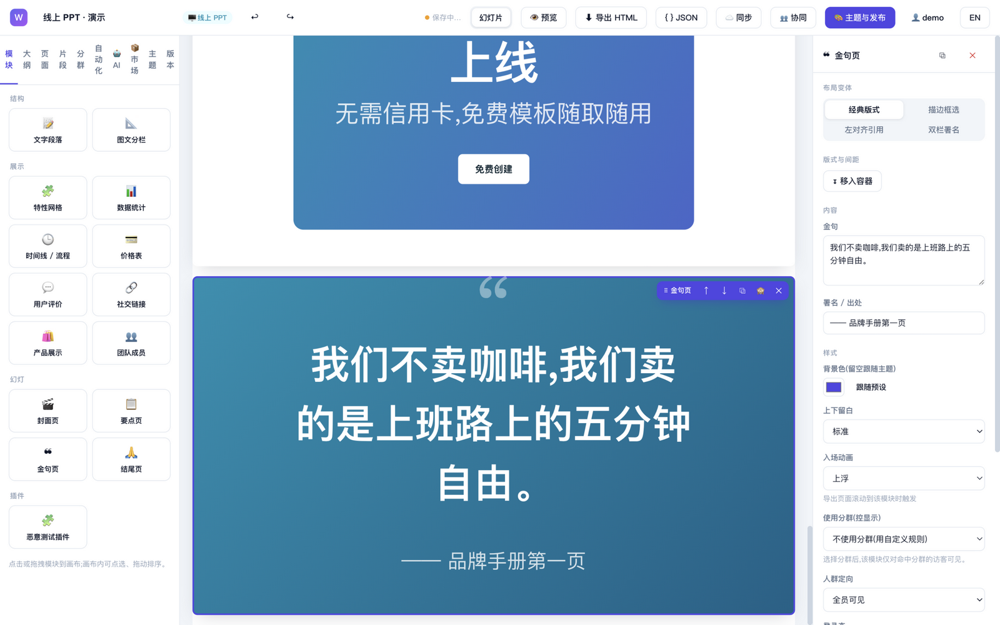

- **用途**:大字金句,用于转场与情绪渲染。
- **适用形态**:PPT
- **布局变体**:3 种

| 可编辑字段 | 说明 |
| --- | --- |
| 金句 | 多行文本 |
| 署名 / 出处 | 文本 |

#### 🙏 结尾页 `slide-end`

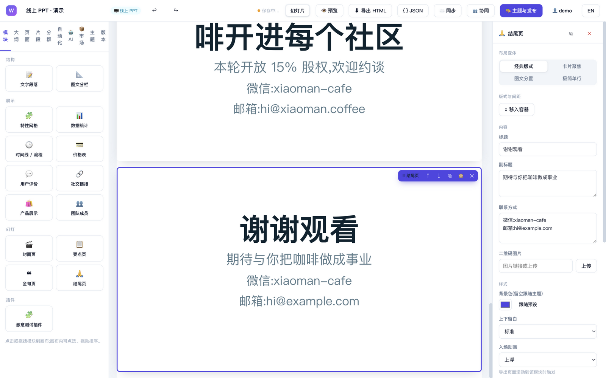

- **用途**:致谢 + 联系方式,可放二维码。
- **适用形态**:PPT
- **布局变体**:3 种

| 可编辑字段 | 说明 |
| --- | --- |
| 标题 | 文本 |
| 副标题 | 多行文本 |
| 联系方式 | 多行文本 |
| 二维码图片 | 图片 |


---

## 五、行业模板与场景模板

新建页向导第二步即是模板画廊(截图见[第二节](#二新建页向导形态--模板--命名)):

| 行业模板 | 定位 | 内置叙事 |
|---|---|---|
| 产品官网 | SaaS / App 通用落地页 | 特性 · 数据 · 评价 · 价格 |
| 电商店铺 | 服装 / 配饰 / 生活好物 | 产品展示 · 价格 · 评价 |
| 教育机构 | 在线课程 / 培训机构 | 课程展示 · 师资 · 报名 |
| 餐饮品牌 | 餐厅 / 咖啡馆 / 烘焙店 | 菜单 · 环境 · 预约 |
| 个人作品集 | 设计师 / 摄影师 / 自由职业者 | 作品展示 · 技能 · 联系 |
| 增长漏斗页 | 诊断式转化叙事 | 信任 → 痛点 → 方法 → 证明 → 行动 |
| 到店服务 | 本地生活 / 到店预约 | 值任务 · 套餐 · 地图 · 留资 |
| 健康预约 | 门诊 / 体检 / 咨询 | 资质 · 流程 · 表单 |
| 空间看房 | 房产 / 民宿 / 空间租赁 | 看房预约 · 空间展示 |
| 空白开始 | 不限 | 从零搭建 |

**怎么用**:模板 = 完整页面 + 行业文案 + 配色,选好直接改字即可上线。登录后还能发布自己的页面为云端模板,供他人引用(可设为付费,见[第十四节](#十四账号配额与商业化))。

---

## 六、主题系统


**这是什么**:全局主题 = 配色预设 + 风格档 + 字体 + 版式参数,一处修改全页生效。

**怎么用**:

- **主题预设**(8 套):靛蓝科技 / 暖阳活力 / 墨绿自然 / 樱花甜梦 / 水岸清爽 / 极简黑白 / 深空暗夜 / 典雅金棕,一键换全站配色;
- **风格档**(5 档):清爽简洁 / 极简工程 / 柔和亲和 / 杂志编辑 / 高对比宣言,控制圆角、阴影、间距等"气质"参数,只影响少数设计锚点,不破坏排版;
- **主色与字体**:主色选择器 + 正文字体/标题字体下拉(标题可继承正文字体);
- **版式**:容器宽度(px)、阴影强度、圆角比例、交互位移。

> 注意:主题在画布与导出页使用同一套运行时样式,所见即所得;改完主题记得刷新画布预览一次再导出。

---
## 七、导出与发布

WebsFlow 有三条"上线"路径,按场景选:

| 路径 | 产物 | 适合 |
|---|---|---|
| 导出 HTML | 单文件 `.html` | 任意静态空间 / 对接广告主自己的托管 |
| 导出 JSON | `.websflow.json` 内容包 | 项目迁移、备份、批量复制 |
| 云端托管 | `https://域名/webflow/p/<token>` | 自带数据回流与千人千面的正式投放 |

### 导出单文件 HTML

导出动作直接下载文件(无弹窗),文件自带 SEO Meta、OG/Twitter Card、JSON-LD、图片懒加载,双击即可打开,与画布所见完全一致。


**怎么用**:顶栏「⬇ 导出 HTML」;上线前建议先点「👁 预览」在新窗口看一遍真实渲染效果(预览与导出走同一构建函数,所看即所得)。

### 托管 SSR 发布页


**这是什么**:登录并同步后,「发布」会把项目变成一个服务器直出的页面(服务端渲染,URL 稳定,可挂广告平台)。托管页与导出页共用同一渲染内核,还额外支持:

- 服务端人群判定(与浏览器端逻辑同源,不受浏览器限制);
- 事件回传:pageview / cta_click / form_submit 自动上报;
- A/B 与版本切换(配合后台「落地页」页使用);
- 子页路由 `/webflow/p/<token>/<slug>`。

**怎么用**:编辑器「☁️ 同步」上传项目 → 后台「落地页」或编辑器「发布」获取链接 → 把链接填进广告平台。取消发布后链接立即失效(访客看到友好下线页)。

---

## 八、千人千面与分群

**这是什么**:WebsFlow 的差异化能力。传统页面"千人一面",这里可以给**每一个模块**配置人群定向,让同一页面对不同人呈现不同内容。

**判定维度**(组合使用):

| 维度 | 取值 | 典型用法 |
|---|---|---|
| 访客身份 | 新访客 / 老访客 | 新人看 0 元体验,老人看进阶套餐 |
| 登录态 | 已登录 / 未登录 | 已登录隐藏注册引导 |
| UTM 来源 | 任意字符串 | `utm_source=google` 的访客看搜素场景文案 |
| 设备 | 手机 / 桌面 | 移动端突出一键拨号 |
| 国家 | 任意国家码 | 多地区投放差异化合规文案 |
| 时段 | 如 `9-18` | 工作时间显示"立即咨询",夜间显示"留言回电" |

**怎么用**:

1. 左栏「分群」新建分群,组合上述规则(截图见[第三节](#5-分群千人千面));
2. 画布选中任意模块 → 检查器底部「使用分群(控显示)」→ 选择分群或自定义规则;
3. 导出页在浏览器端判定;托管页在服务端判定(逻辑同源,结果一致);
4. 数据回流时事件自动携带分群标记,后台可按分群拆解转化。

---

## 九、数据与转化

### 事件模型

页面自动回传三类事件,也接受外部系统投递的自定义事件:

| 事件 | 触发 | 说明 |
|---|---|---|
| `pageview` | 页面浏览 | 托管页自动上报 |
| `cta_click` | 行动按钮点击 | 模块内 CTA 自动绑定 |
| `form_submit` | 表单提交 | 生成 `lead` 线索事件 |

外部事件经 `POST /webflow/api/ingest` 投递(需 API 密钥 + ingest 权限,幂等去重),自动参与实时看板 / 分群归因 / A/B 计量。

### 转化看板

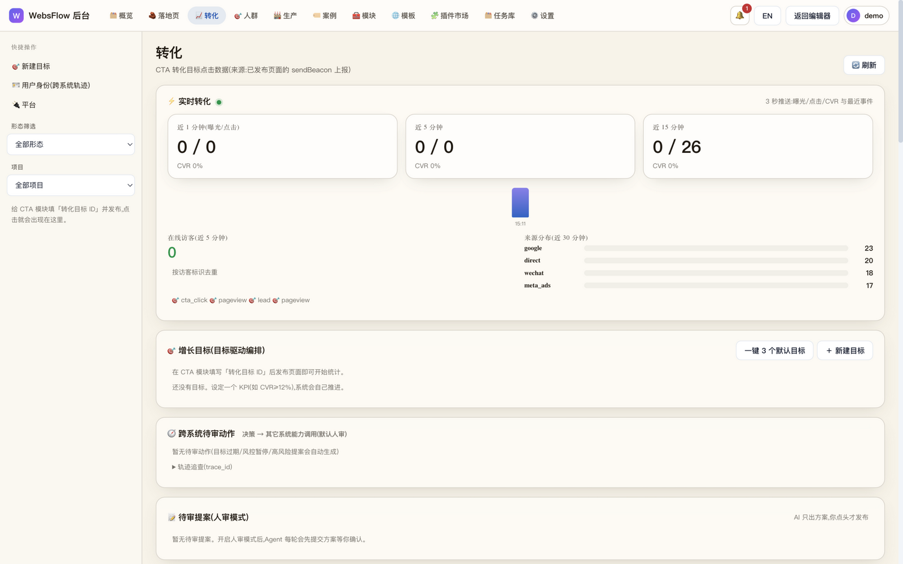

**这是什么**:点击趋势、转化漏斗、目标达成度的可视化看板,支持 13/30/90 天切换。

**怎么用**:先在「目标」里定义转化目标(如 `lead` 事件 × 某个分群),看板自动呈现每目标达成曲线;数据来自已发布页面的真实点击,导出的静态页不回传(无后端),需要数据请用托管发布。

---

## 十、生产流水线

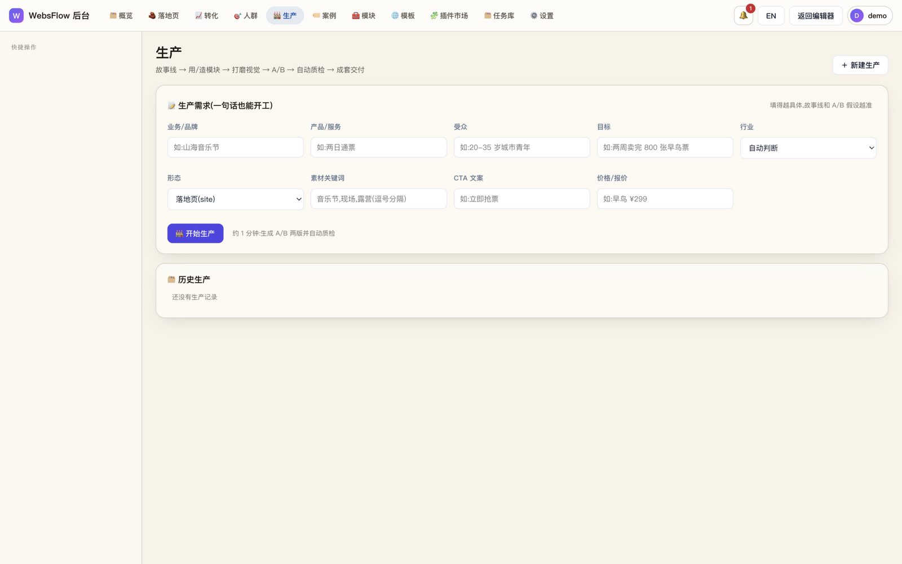

**这是什么**:把"批量出页"组织成生产线的后台模块:**故事线(叙事骨架)→ A/B 变体批量生成 → 质检(文案/合规/链接检查)→ 交付包**。

**怎么用**:

1. 「生产」页新建故事线:定义目标人群、卖点、行动目标,AI 未配置时使用规则故事线;
2. 一键生成多个变体(不同标题/角度/配色),进入变体管理;
3. 跑质检:链接可达、敏感词、移动端适配等检查项;
4. 质检通过的变体打交付包,一键发布为托管页或导出 HTML。

配额说明:出页次数计入套餐(免费版 20 次/日),出页时长目标 ≤ 10 分钟(概览页有中位时长统计)。

---

## 十一、后台 Console 逐页说明

登录后从编辑器右上角进入「后台」(或直接访问 `#/console`)。侧栏共 11 个页面:

### 概览


投放闭环总览:云端项目数、总点击、转化目标数、已分享页、出页中位时长;点击趋势折线图;最近事件流;渠道归因(按邀请人 / 按 UTM);今日体检(AI 供应商、API 密钥、增长目标、收款通道、埋点状态等检查项,一键修复);案例墙与最近页面快捷入口。

### 落地页

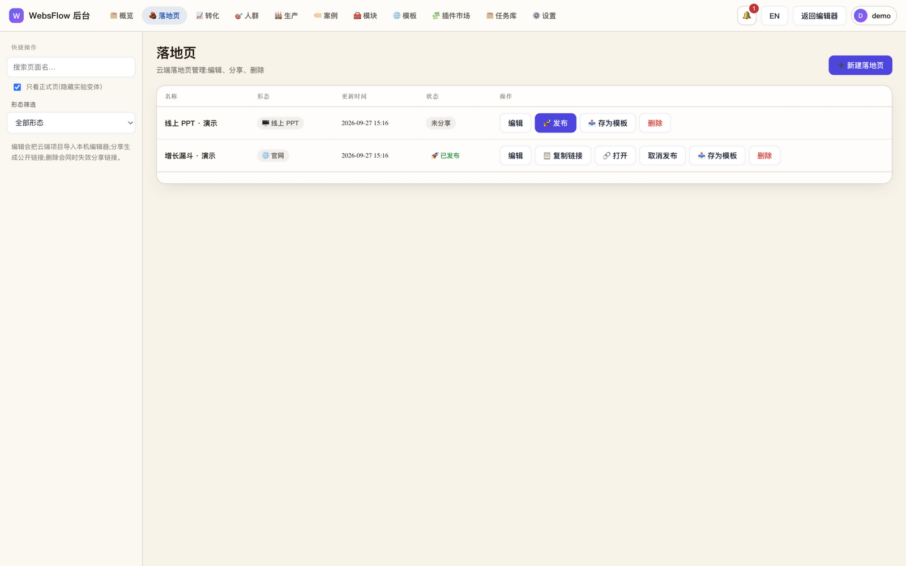

云端项目管理:列表、编辑、发布/取消发布、复制链接、版本快照、删除。发布的页面在这里拿到 `<token>` 链接。

### 转化

见[第九节](#九数据与转化)。目标编排:新建转化目标(事件 × 分群 × 时间窗),目标会驱动看板与增长 Agent 的评估。

### 人群

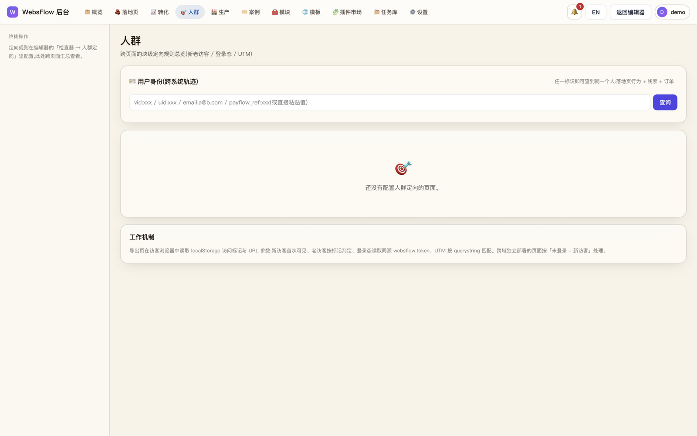

分群规则总览:跨项目查看所有已配置的人群定向规则,快速发现"哪个项目在跑什么人群"。

### 生产

见[第十节](#十生产流水线)。

### 案例

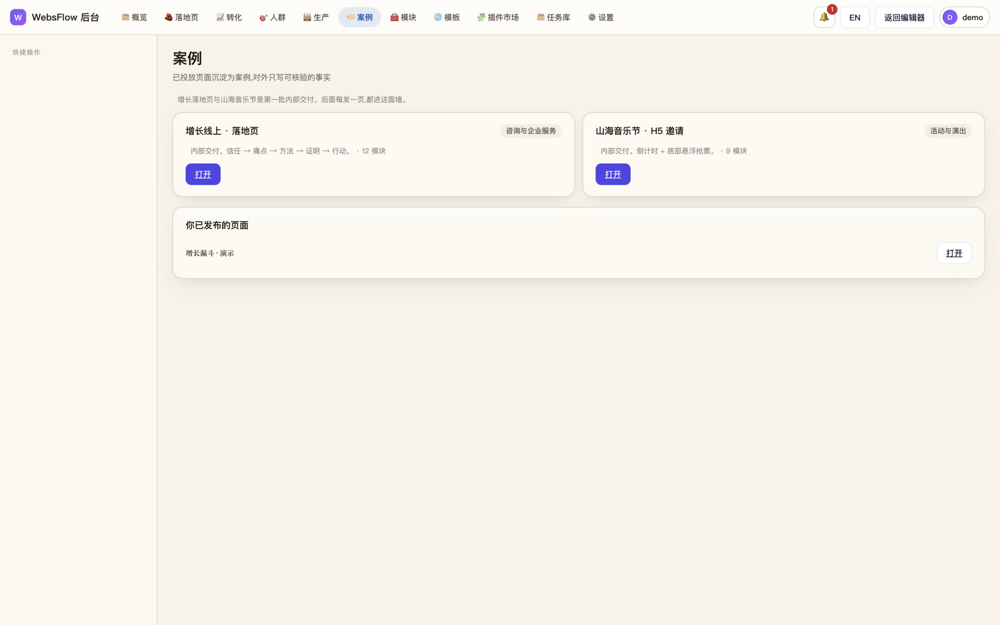

案例墙:官方与社区精选案例(行业标签 + 打开链接),也是你发布页面后沉淀案例的地方。

### 模块

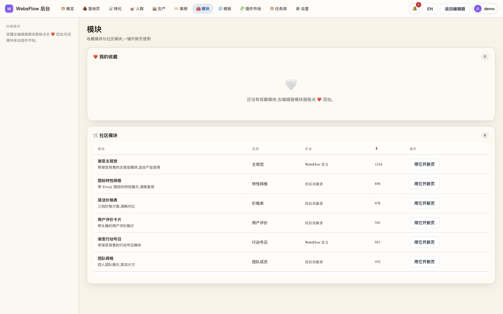

模块资产总览:内置模块、已安装插件、我的收藏;支持把常用模块设为收藏,编辑器左栏置顶显示。

### 模板

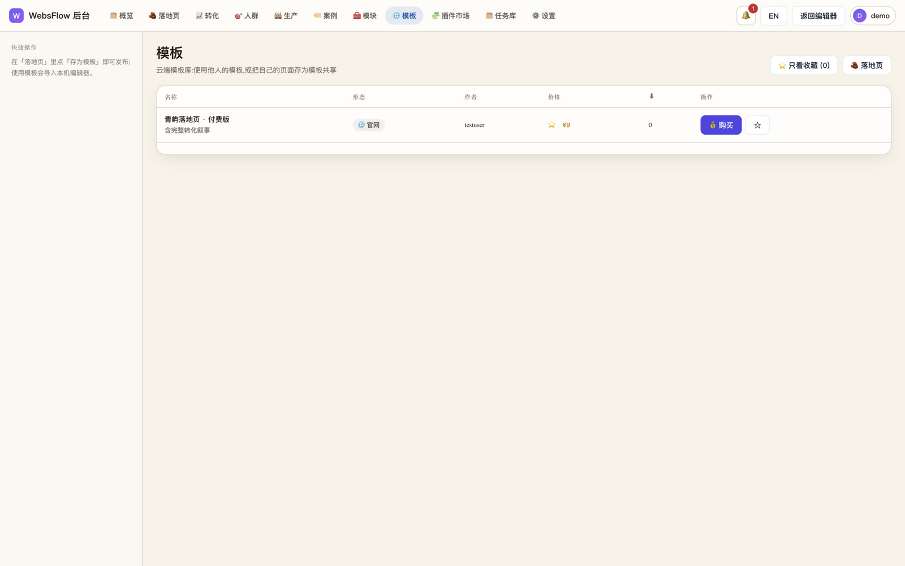

云端模板库:使用他人的模板,或把自己的页面发布为模板共享(可标价)。付费模板的购买与余额消费在站内完成。

### 插件市场

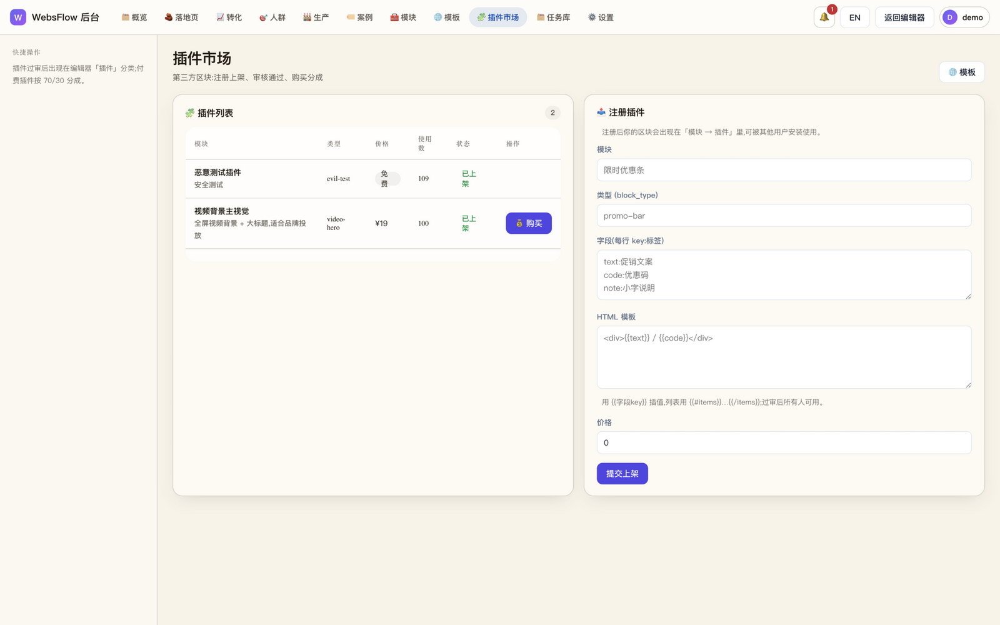

安装/卸载模块插件。插件是带 schema 的自定义模块(JSON 声明字段 + HTML 模板),安装后立即出现在编辑器左栏「插件」分类。

### 任务库

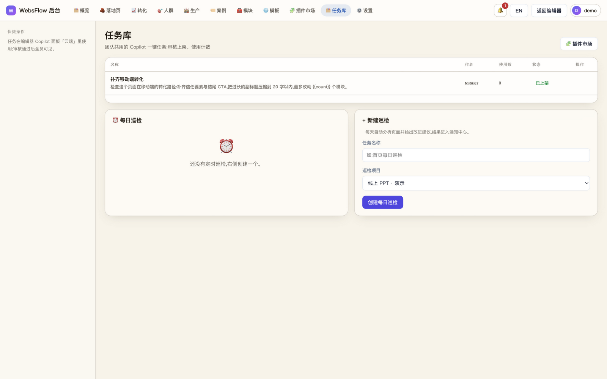

AI 任务模板:出页任务、文案任务、检查任务的提示词模板库;支持自定义任务,与编辑器 Copilot 面板共享。

### 设置

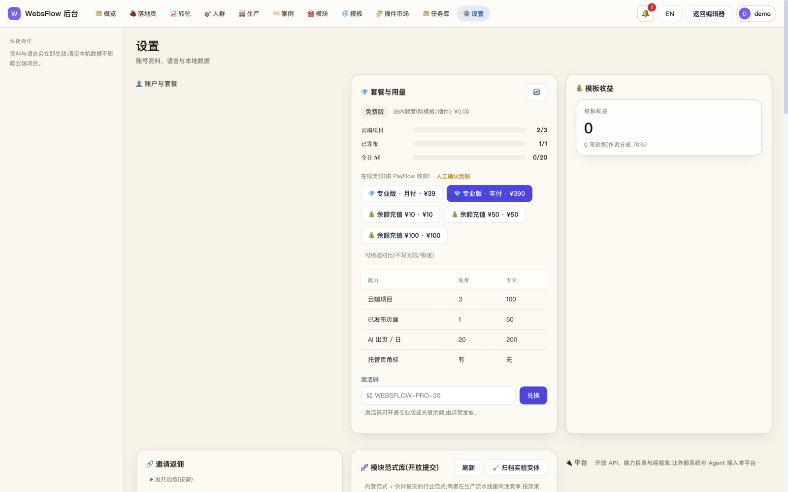

账号资料、AI 供应商配置、API 密钥管理、通知渠道、收款(PayFlow)映射状态等。

---

## 十二、AI 能力与任务库


**有什么**:

- **编辑器 Copilot**(右下角悬浮窗):任务模板芯片(改写主视觉、加价格表、生成 FAQ…)、对话式改稿、每条 AI 修改可一键撤销;
- **AI 出页**:生产流水线里按故事线生成整页草稿;
- **任务库**:内置任务(规则即时执行)与 AI 任务(需模型)双轨,均可自定义。

**边界(诚实)**:未配置 AI 供应商时,所有 AI 任务**明确降级**为规则执行或直接提示,不假装成功;AI 产出均为草稿,发布前必须过人工确认。

---

## 十三、开放能力:API / MCP / 插件

### REST API(27 组路由)

全部后台能力程序化可操作,登录态走 Bearer Token,机器调用走 API 密钥(可限权):

| 路由组 | 能力 |
|---|---|
| `users` | 注册 / 登录 / 资料 |
| `projects` | 项目 CRUD、发布、版本、人群规则总览 |
| `events` | 事件上报、实时流、统计 |
| `ingest` | 外部系统事实事件投递(幂等) |
| `goals` / `metrics` | 转化目标编排、指标查询 |
| `identity` | 访客身份打通(vid ↔ uid ↔ PayFlow) |
| `segments`/`automation`(经 projects) | 分群与页面自动化 |
| `growth` / `patterns` / `lessons` | 增长建议、模式库、经验库 |
| `produce` | 生产流水线(故事线 / 变体 / 质检) |
| `templates` / `plugins` | 云端模板与模块插件市场 |
| `billing` / `referral` | 计费、邀请返佣 |
| `tasks` / `scheduled` / `alerts` / `notifications` | 任务、定时、告警、通知 |
| `actions` / `review` / `webhooks` | 跨系统动作(OpenFlow/PayFlow)、人审闸门、外发回调 |
| `tools` / `capabilities` / `selfcheck` | 工具注册、能力目录(41 条)、系统自检 |
| `ai` / `layout-presets` / `lessons` | AI 网关、版式预设、经验沉淀 |

### MCP Server

内置 MCP(`mcp/` 目录):AI Agent(如 Claude)可直接列出项目、读取看板、创建页面——WebsFlow 的全部能力对 Agent 生态开放。

### 模块插件

插件 = 字段 schema + HTML 模板,几十行 JSON 即可注册一个自定义模块:

```js
WF.registerPluginBlocks([{
  block_type: "my-block",
  name: "我的模块",
  description: "一句话说明",
  fields: [{ key: "title", label: "标题", type: "text" }],
  template: "<h2>{{title}}</h2>",
}]);
```

字段类型支持 text / textarea / list / image;模板支持 `{{字段}}` 与 `{{#列表}}…{{/列表}}` 语法,输出自动过 XSS 净化。安装到市场后,其他用户一键使用。

---

## 十四、账号、配额与商业化

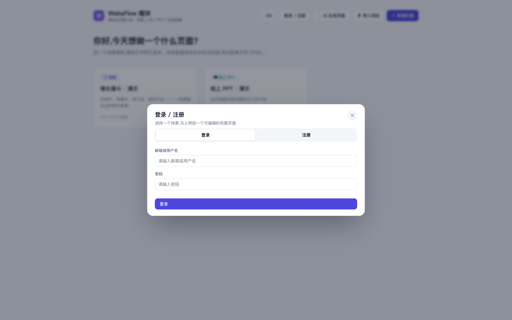

**套餐**(收款走 PayFlow,自部署可完全关闭):

| 档位 | 价格 | 云端项目 | 发布页数 | AI 出页 |
|---|---|---|---|---|
| 免费版 | ¥0 | 3 | 1 | 20 次/日 |
| 专业版 · 月付 | ¥39/月 | 100 | 50 | 200 次/日 |
| 专业版 · 年付 | ¥390/年 | 同月付 | 同月付 | 同月付 |

- 纯本地使用(不登录、不同步)不占配额,核心功能无限制;
- 配额触顶时,升级提示带**可核验的对比表**,不玩文字游戏;
- 余额充值(¥10/¥50/¥100)仅用于模板/插件站内消费;
- 商业化的边界:核心功能永久开源(见 README「开源开放」),收费仅限市场付费模板与定制化开发服务。

---

## 十五、快捷键与实用细节

| 快捷键 | 作用 |
|---|---|
| `⌘Z` / `Ctrl+Z` | 撤销 |
| `⇧⌘Z` / `Ctrl+Shift+Z` | 重做 |

(输入框聚焦时快捷键自动让位;更多快捷键在路线图上。)

实用细节:

- **自动保存**:改动即存,顶栏「● 已保存」即心跳;断电不丢内容;
- **file:// 兼容**:零依赖设计,双击 index.html 即可用,是特性不是缺陷;
- **字体栈一律单引号**:在检查器填字体名含引号时,系统已处理,无需手动转义;
- **数据归属**:本地数据在浏览器 localStorage,云端数据在你自部署的数据库(单文件,直接备份)。

---

*本附录由 v4.38.0 代码与真实截图生成;模块字段表来自 `js/schema.js` 的内容模型注册表,可用 `node scripts/gen-module-docs.js` 重新生成。*
